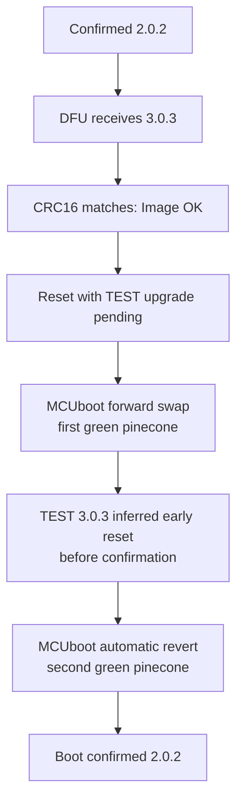

# InfiniTime 3.0.3 boot incident assessment

**Assessment date:** 2026-08-10  
**Affected versions:** 3.0.0–3.0.3  
**Replacement under test:** none; 3.0.4 engineering work is frozen  
**Release status:** superseded by clean-rewrite planning; do not build or flash

> **2026-08-10 pivot:** The owner chose a clean rewrite from current main rather
> than continue this candidate. Branch `family-rewrite` contains the review-only
> proposal. The artifact sizes/hashes later in this report describe the last
> fully packaged pre-pivot build; a final narrow weather freshness source fix
> was tested as an ARM object/host/simulator change but not relinked and
> repackaged across all six targets. Those artifact anchors are therefore not a
> claim about the current dirty `family-features` tree.

> Do not flash 3.0.3 again. Its published update file is structurally valid,
> but the application has insufficiently proven runtime RAM margin and several
> early-boot failure paths that can reset before the screen becomes useful.
> 3.0.4 is a frozen engineering candidate, not a stable release.

## Executive assessment

The observed sequence is most consistent with the update transport doing what
it was designed to do. `Image OK` meant the DFU CRC matched. MCUboot then
installed 3.0.3 as a **TEST** image, a reset occurred before confirmation, and
MCUboot performed a second pass to restore the previously confirmed 2.0.2. The
two green pinecones are therefore strong evidence that rollback worked, not
that the same update was installed twice. A bootloader fault before application
entry cannot be excluded without SWD, although the published image validates
structurally and no bootloader fault-blink report was observed.

The highest-confidence application cause is RAM pressure combined with the old
startup order. The whole 3.0.3 FreeRTOS heap was nearly consumed by the amount
that the photographed 2.0.2 had allocated at an ordinary instant, and was well
below 2.0.2's observed peak. 3.0.3 also initialized NimBLE before proving that
the display task had rendered. An unchecked allocation or assertion on that
path requests `SYSRESETREQ`, consistent with the photographed `softr` reason.
The exact first failed allocation cannot be reconstructed without a trace from
the failed image, so this is a high-confidence causal diagnosis rather than a
claim of instruction-level proof.

A second observation changes the scope of the blackout problem: on 2026-08-10,
the confirmed 2.0.2 image also became black and button-unresponsive for hours,
off charger and after recently reporting substantial charge. Both reported
long-lived blackout episodes had the Family face selected. This rules out
3.0.3's new StorageTask as the sole cause of those blackouts.

The leading explanation for the long-lived blackout is now an inherited
display-task/SPI liveness defect, distinct from the immediate 3.0.3 update
rollback. Exact 2.0.2 code can leave DisplayApp blocked forever while the
higher-priority SystemTask continues feeding the watchdog. There is also a
concrete reason Family produced exceptional redraw load: an inherited weather
equality typo compares the minimum temperature with the *other maximum*.
Whenever the daily low and high differ, unchanged weather is consequently
treated as new every 20 ms. Family then rewrites and realigns its weather and
date row 50 times per second. That defect is certain and is a credible exposure
amplifier for SPI, heap, and battery faults; it is not, by itself, proof of the
instruction where either blackout began. The candidate fixes the equality,
bounds the display path, and ties watchdog feeding to display progress.

The weather review also found concrete undefined-behavior paths inherited from
upstream. The old GATT callback parsed the first mbuf segment without checking
the operation or total length. If MTU negotiation failed, a nominal 53- or
36-byte update could arrive as only 20 bytes and was still read through byte 52
or 35. The resulting garbage temperatures fed an unchecked three-byte padding
array in the Weather app, where an extreme digit-width difference could write
past the stack buffer. BLE and Display tasks also accessed the same optional
weather objects without synchronization. These defects make the weather stack
a stronger plausible trigger or amplifier, but no retained trace proves that
this exact chain occurred on either blackout.

## What the observed sequence means

The following is the leading **inferred** path, not an instruction-level trace:

The green fill is a timed bootloader animation/button-sampling period. It is not
a byte-accurate copy-progress indicator.

## Evidence and claim confidence

| Claim | Evidence | Confidence |
|---|---|---:|
| The watch returned to 2.0.2 | The user observed 2.0.2 after the second bootloader pass; the four 2026-08-09 photographs show the resulting live Sys Info pages, but do not themselves display the firmware version | High |
| The published 3.0.3 package was not truncated, stale, or oversized | Tag, ZIP manifest, CRC, MCUboot header/vectors/SHA TLV and 429,364-byte image independently match; slot is 475,136 bytes | Very high |
| `Image OK` did not prove a successful boot | The firmware sets that text after its DFU CRC check, before MCUboot runs | Certain |
| Two bootloader passes followed by the old image are a TEST revert | Bootloader code/trailer layout and the resulting version match this state machine | Very high |
| A reset occurred before confirmation | Revert requires the TEST image to remain unconfirmed; the photographed reset category is `softr` | Very high |
| 3.0.3 application code executed before that reset | RAM/startup evidence supports this path, but a pre-entry bootloader fault remains possible without a trace | Moderate |
| RAM/startup ordering was the primary application fault | Exact ELF heap bounds, physical 2.0.2 heap telemetry, pre-display NimBLE startup, and unchecked reset paths agree | High |
| One named allocation was the first failure | No retained 3.0.3 stage/allocation record exists | Unknown |
| The upstream AOD flash change caused the immediate revert | First-boot failure occurs before normal AOD use; the change addresses a separate storage/display hazard | Low / rejected |
| Confirmed 2.0.2 can also remain black for hours | User observation on 2026-08-10; 2.0.2 source permits a display-only wedge while SystemTask feeds the watchdog | High for symptom; moderate-high for mechanism |
| Stable weather caused continuous redraws | Both current and forecast equality compare `minTemperature` with `other.maxTemperature`; all affected faces poll through `DirtyValue` | Certain when low differs from high |
| Truncated weather input could be parsed out of bounds | The old callback used raw `om_data` without checking operation, packet length, or mbuf chaining; default-MTU writes carry only 20 value bytes | Certain source defect; occurrence unknown |
| Weather processing contained other undefined behavior | BLE and Display tasks raced on optionals, debug logging dereferenced absent forecast days, and extreme temperatures could index beyond a three-byte padding array | Certain source defects; incident role unknown |
| The weather redraw storm triggered either blackout | Family was selected both times and performs the most affected label/layout work, but no retained trace identifies the final stall; the storm stops in full sleep | Credible amplifier; not proven root cause |
| Family alone is the root cause | Family costs more heap and magnifies the inherited weather defect, but Digital, Terminal, PineTimeStyle, and the Weather app also use the faulty equality | Rejected as a unique cause |

### Photo telemetry

The recovered 2.0.2 reports:

- heap total: **34,968 bytes**;
- heap free at the photograph: **11,712 bytes**;
- minimum-ever heap free: **6,568 bytes**;
- current allocation: **23,256 bytes**;
- observed peak allocation: **28,400 bytes**;
- malloc failures: **0** and stack overflows: **0** for that successful 2.0.2
  boot;
- reset reason: **`softr`**;
- external flash ID: **c8-40-16**.

Those zero counters describe the recovered 2.0.2 boot only. They say nothing
about allocations in the 3.0.3 image that had already been reverted.

### Two incident classes

The evidence now supports two related but different failures:

1. **Immediate 3.0.3 TEST-image rollback:** primarily a 3.0.3 RAM/startup-order
   failure. It produces the two bootloader passes and restored 2.0.2.
2. **Hours-long black display on 2.0.2:** primarily an inherited display/SPI
   liveness failure. It can leave the application and possibly BLE alive with
   no panel response and no automatic watchdog reset.

They share scarce RAM and fragile peripheral handling, but the second event
means it would be wrong to label every black screen as a 3.0.3 boot loop.

### How 2.0.2 can stay black indefinitely

The exact 2.0.2 path contains all of the following:

- SystemTask starts a seven-second watchdog and reloads it every 100 ms while
  the side button is released, without checking DisplayApp progress.
- SPI mutex waits use `portMAX_DELAY`; synchronous transfers spin forever on
  `EVENTS_END`; a large asynchronous transfer releases its mutex only from the
  SPIM END interrupt.
- Display panel command return values are ignored, and LVGL can report a flush
  ready before the asynchronous pixel transfer is proven complete.
- The sleep path has an unbounded `while (!lv_task_handler())` loop. In full
  sleep it turns the backlight off before issuing the LCD sleep command.

If DisplayApp loses a completion interrupt or enters a sleep/wake race, the
screen can therefore be off while SystemTask remains healthy enough to feed the
watchdog forever. Button messages cannot make a blocked DisplayApp render. This
matches the historical failure class documented in upstream
[issue #60](https://github.com/InfiniTimeOrg/InfiniTime/issues/60), where the
maintainer identified a sleep/wake SPI race, a Display task stuck in an
infinite loop, and a still-running SystemTask masking it from the watchdog.

### Confirmed weather redraw storm

The same equality typo exists at the exact official 1.16.0-derived base, in
2.0.2, in 3.0.3, and on the newly synchronized official main branch. It was
therefore inherited rather than added by the family-features branch. With a
normal low/high pair such as 17/29 degrees, `CurrentWeather::operator==` and
`Forecast::Day::operator==` both return false for two otherwise identical
values.

While the screen is Running, watch-face refresh tasks run at the configured
20-ms LVGL period. Family responds to each false change with the low/high label,
weather icon, full date, and often shortened-date replacement: 150--200 label
rewrites/reallocation attempts per second, plus layout and display invalidation.
Digital and PineTimeStyle perform two affected label updates per tick, Terminal
one, and the Weather app also rebuilds forecast cells once per second. AOD
reduces the rate to its 500-ms handler cadence; full sleep stops it.

This supplies a concrete explanation for why Family increases exposure even
though its constructor/destructor model has no leak. It can drain power, churn
heap blocks, and keep the old asynchronous SPI path continuously busy while the
screen is awake or in AOD. A display wedge still requires another liveness
failure, and heap_4 fragmentation remains unmeasured rather than proven. The
strongest physical discriminator is whether a weather icon and unequal low/high
range were visible before each blackout.

There was also a finite memory-corruption route. A failed ATT-MTU negotiation
leaves only 20 value bytes in a normal write. The old service nevertheless
decoded all current/forecast fields from the first segment, raced the UI while
publishing them, and allowed garbage extreme values to reach the Weather app's
unchecked padding index. This path is independent of the equality redraw storm
and affects official firmware too; its presence is proven in source, while its
execution on the watch remains unknown.

Bluetooth visibility during the black state is the best available no-SWD
discriminator. A connectable radio strongly supports a display-only wedge. No
radio is less decisive because radio settings, a flat battery, a full-system
failure, or a reset loop can all make BLE absent.

### Safe 2.0.2 reset without re-arming 3.0.3

2.0.2 deliberately withholds watchdog reload while the side button is held.
On a charger, hold the button until the pinecone first appears (about seven
seconds), then **release immediately**. If no pinecone is visible, release at
about eight seconds anyway.

Do not continue holding through the bootloader window. A continued hold makes
the pinecone blue and requests a secondary-slot swap; after an automatic revert
that slot may still contain failed 3.0.3. A still longer red hold enters factory
recovery. The safe operation is “hold until reset, then release,” not “hold
through boot.”

### RAM comparison

| Quantity | Bytes |
|---|---:|
| 3.0.3 complete FreeRTOS heap | 23,288 |
| 2.0.2 allocation at photographed instant | 23,256 |
| Difference before 3.0-only runtime allocations | 32 |
| 2.0.2 observed peak allocation | 28,400 |
| Peak above the complete 3.0.3 heap | 5,112 |

About 2.4 KiB of allocations had moved from heap to static storage in 3.0.3,
which reduces but does not close the peak deficit. InfiniSim previously gave a
false sense of safety because its virtual BLE facade did not instantiate the
hardware NimBLE task stacks, event queues, synchronization objects, ATT/GATT
pools, or CCCD state.

The complete upstream-to-fork static and dynamic attribution is in
[`family-features-ram-analysis.md`](family-features-ram-analysis.md). In short,
2.0.2 loses 5,960 bytes of raw heap to linked state and adds 2,112 bytes of
persistent runtime allocations. Its Family face consumes 5,328 bytes in the
ARM32 LVGL/heap_4 model, 2,088 more than Digital. The later 3.0.3 collapse is
dominated by the new 8,624-byte StorageTask object.

## Why `softr` fits

The deployed bootloader starts and locks a **7.000-second** watchdog immediately
before application handoff (`CRV=0x37fff`). An inherited watchdog expiry would
normally report a watchdog reset. In contrast, release-mode InfiniTime
allocation/assert handlers call the Nordic error path, which requests a system
reset. That is one direct way to obtain `softr`. Other explicit reset paths also
exist, so the reset reason supports but does not uniquely prove allocation
failure.

## Role of the upstream AOD flash fix

The rebased branch includes upstream commit `71d1f5b4`, which keeps SPI and the
external flash awake during always-on display. It is important: AOD still draws
and may read external resources, so putting flash into deep power-down can make
tiles disappear or stall display work. The family storage layer originally
undid that fix after a background operation; 3.0.4 now serializes the physical
power transition and sleeps flash only in full sleep, never AOD.

This is a real secondary fix, not the leading explanation for an immediate
post-update rollback before ordinary AOD operation. It is also not a strong
direct explanation for the 2.0.2 Family blackout: the Family face explicitly
uses internally compiled glyphs and RAM-only counters. The upstream defect was
reported as missing external navigation images, not a complete system freeze.

## Candidate corrections

### Boot remains visible

- Static System and Display resources are created without consuming boot heap.
- The display is initialized before optional BLE and must complete one
  full-screen LCD/SPI transfer within a bounded interval. Physical pixel output
  remains part of the watch test.
- LCD flushes now wait for asynchronous SPIM completion before LVGL reuses the
  buffer. Missing completion interrupts time out, abort DMA, reset the bus, and
  propagate failure instead of retaining the SPI mutex forever.
- SystemTask monitors display progress in Running, GoingToSleep, and AOD states.
- Identical current/forecast weather now compares equal, so stable weather
  renders once rather than rewriting labels at 50 Hz. A host regression runs an
  hour-equivalent 180,000 unchanged assignments and requires zero extra renders.
- Weather writes are copied from the complete chained mbuf and accepted only at
  the exact current v0/v1 or compact/fixed forecast lengths. MTU truncation,
  unsupported versions, trailing bytes, and day counts above five are rejected
  before publication; short critical sections make BLE publication and display
  snapshots race-free.
- Forecast rendering no longer uses unchecked padding indices or pointer-puns a
  wire timestamp as the target's `time_t`, and it clears stale columns when a
  new forecast contains fewer days.
- Current/forecast freshness compares the nonnegative local clock and arbitrary
  64-bit wire timestamp directly in unsigned seconds. Records at least 24 hours
  away are ignored without a narrowing conversion or signed `chrono` overflow;
  the symmetric window retains released-companion timezone compatibility.
- BLE, HR, TWI, and storage failures degrade optional functionality instead of
  immediately resetting an otherwise usable clock.
- Unsafe display or flash-power transitions stop watchdog feeding deliberately,
  allowing an unconfirmed TEST image to revert rather than remain black.

### Failures are bounded and diagnosable

- LFCLK has bounded crystal startup and RC fallback; the SDK driver is always
  initialized before the FreeRTOS RTC port can request it.
- SPI and TWI have bounded mutex, transfer, abort, and recovery paths.
- Filesystem boot work has a five-second aggregate deadline and continues to
  prove display liveness while feeding the inherited watchdog.
- A retained no-init record captures boot stage, the decoded reset-reason
  category, heap free and minimum, malloc failures, stack overflows, and the
  first detected degradation.
- Sys Info exposes the prior record after a same-layout soft reset. MCUboot may
  move/rewrite images during a cross-version revert, so this record is useful
  future evidence but is not guaranteed to survive every rollback layout.

### Update paths reject bad input before destructive work

- DFU enforces the actual MCUboot payload/trailer boundary and checks every
  append against remaining space.
- Validation covers the MCUboot header, all 39 nRF52832 external interrupt
  vectors, TLV structure, SHA-256, and CRC.
- MCUboot's aligned single-byte `image_ok` flag is read correctly.
- The recovery loader caps the factory image at the bootloader's actual
  **0x40000-byte** partition, validates it before erase, checks each flash
  operation, and reads programmed bytes back.

### Protocol and persistent RAM

- Firmware capacity is restored to the released PineTimeCompanion 0.34 contract:
  **32 schedules and 20 tasks**. Version 3.0.3 incorrectly shipped 16 and 12
  without coordinating that change with the companion.
- The nonconforming 3.0.3 family snapshot (1,210 bytes despite advertising
  schema 1) is intentionally rejected. The restored schema-1 layout is 2,146
  bytes, so any data created by a blocked 3.0.3 build returns to defaults.
- Against the same restored 32/20 layout before streaming/unioning, the
  family-state codec and StorageTask I/O refactor removes exactly 3,112 bytes of
  overlapping persistent scratch. This is a scoped gross saving, not a claim
  that the whole candidate uses less static RAM than published 3.0.3; safety
  resources were also moved from heap to static storage.
- Bond persistence borrows its immutable in-flight image instead of making a
  second large copy.
- Completion generations prevent a timed-out request from satisfying a later
  caller accidentally.

### Candidate RAM model and scope

The candidate now uses one synchronous two-row LVGL transfer buffer, replaces
several high-object-count controls with compact equivalents, and uses a
four-byte `XorShift32` generator for Dice instead of the roughly 2.5-KiB
`std::mt19937` state. The default build includes only Digital, Analog, and
Terminal watch faces. PineTimeStyle, Infineat, CasioStyleG7710, and Family
remain available to explicit custom builds, but are excluded from this
candidate because their modeled screen peaks are 5,424, 11,248, 14,472, and
5,536 bytes respectively. A persisted selection for an excluded face falls
back to Digital. This deliberately removes the Family **watch face** from the
default product image (the family services/apps remain); its modeled remainder
would be only 1,024 bytes, so retaining it would contradict the RAM gate.

The current Release ELF and an exact 32-bit heap_4/LVGL allocation model give:

| Candidate quantity | Bytes |
|---|---:|
| Linker-reported RAM | 45,296 |
| Raw `__HeapBase` to `__StackLimit` span | 19,216 |
| Allocator-usable initial heap | 19,208 |
| Modeled persistent non-screen allocation | 12,648 |
| Largest included screen construction peak (Set Date) | 3,096 |
| Optimistic fully-coalesced remainder | **3,464** |

The 12,648-byte term is a reconciliation model, not a candidate measurement.
The recovered 2.0.2 snapshot had 23,248 bytes in physical heap_4 blocks
(34,960 usable minus 11,712 free). From that, the model subtracts 9,736 bytes
of tasks, queues, timers, synchronization objects, and NimBLE stack/TCB storage
that are static in the candidate; adds 72 bytes for the new stable FamilyState
GATT allocation; and subtracts the exact 936-byte live Sys Info screen visible
in the photograph. It deliberately leaves all other real controller, NimBLE,
filesystem, LVGL/theme, and already-created heart-rate allocations in place.

Every default face, default app, settings page, and internally reachable screen
was modeled with ARM class sizes, heap_4 alignment/headers, construction peaks,
and teardown. The next-highest peaks are Dice at 3,056 bytes, Prayer Location
at 3,040, the 12-hour MultiAlarm editor at 3,032, Prayer Method at 3,008, and
Analog at 2,976. This closes the earlier source-accounting gap, but **does not
close the physical RAM gate**: the model assumes unchanged unidentified
background allocations and a fully coalesced heap, while the photograph was a
short-uptime, unconnected boot. BLE connection, maximum companion data,
storage traffic, HR activity, and allocation churn can only be measured on the
watch.

Sys Info now reports heap_4's actual largest currently allocatable payload.
The former “LVGL free/largest” values were always zero because LVGL uses the
custom FreeRTOS allocator in this build; they were not fragmentation evidence.

## Automated validation completed

The 2026-08-10 non-physical gate passes on the current engineering tree:

- fresh Release builds completed for the autonomous and MCUboot variants of
  the app, recovery image, and recovery loader;
- all three MCUboot images report version `3.0.4+0`, pass `imgtool verify`, fit
  their bounds, and remain byte-identical when packaged into test DFU ZIPs;
- the native host suite passes **43/43** both normally and under ASan/UBSan;
  the weather target performs 58 equality, quiescence, timestamp-boundary,
  signed-decoding, length, version, and compatibility checks;
- generated protocol outputs for InfiniTime, InfiniSim, PineTimeCompanion, and
  pinetime-dev-tools are current;
- a fresh InfiniSim build passes **3/3** CTests, and GUI smoke covers the
  default-face fallback, merged status widgets, Schedule paging, MultiAlarm in
  12/24-hour modes, Timer, Dice, Set Date/Time, HR/Display button matrices, and
  the new Sys Info heap page. A final real-parser weather smoke renders
  unequal-range/extreme signed values and proves a five-day forecast shrinks to
  two days without stale columns;
- final independent follow-up reviews after the weather P1 fixes found no
  remaining concrete boot, power, allocator, parser, synchronization,
  stack-frame, or compact-control regression. Static frame sizes fit their
  assigned task stacks, but cumulative high-water marks remain a hardware
  measurement.

The final fresh-build artifact accounting is:

| MCUboot image | Payload before header/TLV (bytes) | Complete image (bytes) | Relevant remaining bound (bytes) |
|---|---:|---:|---:|
| App | 408,784 | 408,856 | 65,848 to the slot's maximum image boundary |
| Recovery | 227,856 | 227,928 | 34,216 in the 0x40000 factory partition |
| Recovery loader | 247,192 | 247,264 | 227,440 to the slot's maximum image boundary |

The app payload consists of 407,888 bytes of text plus 896 bytes of initialized
data; calling 407,888 bytes the whole flash image would omit that data. Linker
RAM remains 45,296 bytes and allocator-usable heap remains 19,208 bytes.

The validation-only app-image SHA-256 is
`8d8a4fa36b5adffc7736b8d963c350942613f57bf0f3a823f220e60fe70d82a5`.
The recovery and recovery-loader image hashes are respectively
`6629e4cf5b57e46e261e052b0bd3bd3a6f9fd660be7c5289bff49fe44885f544`
and `2e61ae7c6255223a8c8b3ed73aa8e3937eb6fcbb80b5348e8b861da35601fc6b`.
All were built from an uncommitted engineering tree whose version screen
records only committed `HEAD` (`e57b02b0`), not the dirty diff. **None of these
three images or test DFU ZIPs is a traceable release or approved for flashing**;
the recovery loader is destructive and its factory-image replacement is not
atomic. Before physical testing, build from a committed clean tree and record
that exact app-image hash again.

## Remaining release gates

Automated success is necessary but cannot prove physical nRF52832 heap margin,
radio timing, panel behavior, or MCUboot power-loss recovery. Do not publish
3.0.4 until all of these pass on a sacrificial watch:

1. Recover and characterize confirmed 2.0.2 first: record whether BLE remains
   visible while black, whether AOD was enabled, the result of the safe
   hold-until-pinecone reset, the next reset reason, and fresh RAM pages. On
   2.0.2, use Digital with AOD off for the initial control soak; only then use
   its existing Family face and AOD as separate diagnostic variables.
2. Record the exact candidate SHA-256 and begin from that confirmed 2.0.2
   control state.
3. Install the candidate three times, confirming each boot reaches the clock
   promptly and reporting the new Sys Info boot/RAM pages.
4. Reboot repeatedly before and after image confirmation and deliberately test
   automatic rollback with an unconfirmed candidate.
5. Pair, synchronize the maximum 32 schedules and 20 tasks, transfer files, run
   DFU validation, enable heart rate, and churn the heaviest watch faces/apps.
6. Record minimum-ever heap after BLE sync, HR activity, storage mutation, and
   screen churn. Require at least **3,072 bytes minimum-ever free**, at least
   **4,096 bytes currently allocatable in one block** after returning to Sys
   Info from each churn pass, and zero malloc or stack failures. These are
   acceptance thresholds, not values the candidate has already demonstrated.
7. Exercise full sleep, AOD, background storage during AOD, wrist/button/touch
   wake, charging wake, and at least 100 sleep/wake cycles.
8. Interrupt power during safe update phases and prove that either the prior
   confirmed app or recovery path remains available.
9. Soak for at least 24 hours before creating a prerelease. Promote only after
   a second clean install/soak cycle.
10. Do not add the current 5,536-byte Family face to the default candidate.
    Re-enable a compact replacement only in a separate diagnostic build after
    it passes the allocation, extreme-layout, BLE/storage/AOD, and hardware
    soak gates described in the RAM analysis.

## Remaining uncertainty and security boundary

- No SWD/JTAG trace exists for the failed boot, so the exact first reset site is
  unknowable after the fact.
- SHA-256 and readback provide integrity, not authenticity; these images are
  still unsigned.
- Factory-image replacement cannot be atomic with the current external-flash
  layout.
- A physical-equivalent worst-case RAM gate remains mandatory even when all host
  and simulator tests pass.

## Reproduction anchors

- Failed release source: tag `v3.0.3`, commit `743728d5`.
- Published application-image SHA-256:
  `e2ce13fae59fc81b23832f938e4fa64b3e727bcb25dfef5c589a29f77bbb3275`.
- Published DFU ZIP SHA-256:
  `9769bced853095aa5f43c4f8c293f81e6de1cf1c1eca6d361fbf2cbf2757af80`.
- Preserved history: branch `backup/family-features-v3.0.3`.
- Rebased upstream base: `8d7a04e9`.
- Included AOD fix: `71d1f5b4`.
- MCUboot slot size: 475,136 bytes; trailer: `0x1b0`; maximum image boundary:
  `0x73e50`.
- Bootloader factory partition: `0x40000` bytes.

This document intentionally separates observed facts, high-confidence
inference, and unresolved claims. A successful build is not represented as a
stable firmware release.
