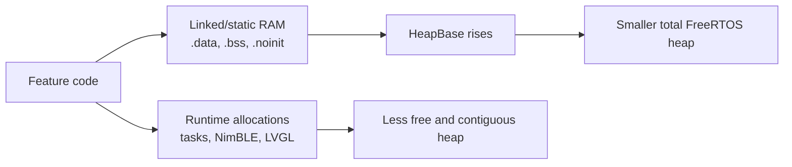

# Family-features RAM baseline

**Assessment date:** 2026-08-10  
**Exact upstream fork point:** `8a9ccf21`  
**Compared fork releases:** `v2.0.2` (`c8f2980e`) and `v3.0.3`
(`743728d5`)

This analysis separates two different uses of the PineTime's 64 KiB SRAM:

Static objects reduce the total heap before the firmware starts. Runtime
objects consume what remains. Looking only at either number gives an incomplete
answer.

## Exact baseline and lineage

The family branch was not based on the later official `1.16.1` hotfix line.
Its exact merge base with the current official main branch is `8a9ccf21`, a
version-1.16.0 snapshot four commits after the `1.16.0` tag. Clean Release
builds of that fork point, official `1.16.1`, and current official main have the
same aggregate RAM sizes. Current official main does contain `71d1f5b4 Keep
external flash awake during AOD`; that behavioral change adds no global/static
RAM.

All values below come from clean MCUboot-app builds with the same GCC Arm
10.3-2021.10 toolchain and nRF5 SDK 15.3.0 configuration:

| Build | `.data` | `.bss` | `.noinit` | Linker RAM used | Raw heap | heap_4 usable |
|---|---:|---:|---:|---:|---:|---:|
| Exact upstream base | 944 | 22,624 | 16 | 23,584 | 40,928 | 40,920 |
| Official `1.16.1` | 944 | 22,624 | 16 | 23,584 | 40,928 | 40,920 |
| Official current main | 944 | 22,624 | 16 | 23,584 | 40,928 | 40,920 |
| Fork `2.0.2` | 944 | 28,572 | 18 | 29,538 | 34,968 | 34,960 |
| Fork `3.0.3` | 944 | 40,204 | 66 | 41,218 | 23,288 | 23,280 |

The rebuilt 2.0.2 raw heap exactly matches the **34,968-byte** total on the
physical watch. The rebuilt 3.0.3 section and image sizes exactly match the
published prerelease artifact.

### Direct answer: where the family branch RAM went

From the exact upstream base to 2.0.2, linked state reduces raw heap by **5,960
bytes**: 4,200 bytes are the expanded SystemTask/NimBLE object, 832 bytes are
net bond-store arrays, and 920 bytes are the other family-feature globals.
Persistent runtime objects consume another **2,112 bytes** after startup. The
Family face is a separate active-screen cost: **5,328 bytes**, or **2,088 bytes
more than Digital**, only while selected.

From 2.0.2 to 3.0.3, linked state removes a further **11,680 bytes** of raw heap.
The new StorageTask accounts for 8,624 bytes; 2,424 bytes are mostly FreeRTOS
resources relocated from heap to static RAM, with the balance in SystemTask and
retained diagnostics. Thus the watch face contributes to peak pressure, but it
does not explain most of the branch's persistent RAM growth or the sharp 3.0.3
collapse.

## What 2.0.2 added over upstream

The 2.0.2 fork loses **5,960 bytes** of raw heap before runtime. The linked
static growth is attributable as follows:

| Static change | Bytes | Explanation |
|---|---:|---|
| Global `SystemTask` object | +4,200 | Primarily the embedded expanded `NimbleController`: five-peer bond snapshots, codec/coordinator/registry state, six added GATT service objects, and radio recovery state. This is not the SystemTask stack. |
| Bond-store arrays, net | +832 | New five-peer/40-CCCD config arrays replace the smaller upstream RAM store. |
| Other feature globals, net | +920 | Schedule, tasks, prayer, multi-alarm, beacon, alert queue, filesystem lookahead, BLE radio state, and display changes. |
| Named-object total | **+5,952** | Actual `.bss + .noinit` grows by 5,950 bytes; section fill and the aligned heap boundary account for the few-byte differences. |

The largest static cost in 2.0.2 is therefore multi-phone BLE bond/service
support, not the Family watch face.

The fork also consumes more heap after startup. Exact ARM32/FreeRTOS accounting
finds these persistent additions over upstream:

| Runtime addition | Physical heap bytes |
|---|---:|
| SystemTask stack: 350 to 600 words | +1,000 |
| Recursive filesystem mutex | +88 |
| Prayer and Schedule timers, net of MultiAlarm replacing Alarm | +112 |
| Four NimBLE callout timers for bond/radio management | +224 |
| Six GATT services, 13 characteristics, and 32 attributes | +688 |
| **Persistent runtime total** | **+2,112** |

GATT registration also needs a transient 24-byte pointer-array increase during
startup. The added controllers otherwise use fixed-capacity storage rather
than hidden STL allocations.

## The Family face specifically

The official base has no Family face. An exact 32-bit LVGL/heap_4 model of the
2.0.2 source gives:

| Face | Heap footprint | Live allocations |
|---|---:|---:|
| Digital | 3,240 | 111 |
| Analog | 2,976 | 102 |
| Terminal | 2,392 | 88 |
| Family | **5,328** | **167** |
| PineTimeStyle | 5,424 | 169 |
| Infineat | 11,248 | 194 |
| CasioStyleG7710 | 14,472 | 188 |

Family costs **2,088 bytes and 56 allocations more than Digital** while it is
active. It is expensive and leaves less room for BLE and transient work, but it
is not the largest face in 2.0.2. Its fonts and icons are compiled into internal
flash, and its task count is read from RAM, so the upstream AOD external-flash
fix does not directly supply a missing Family-face resource.

The modeled constructor has no temporary peak above its final 5,328-byte
footprint. Destruction returns its modeled blocks to the allocator; no
constructor/destructor leak was found.

A separate inherited bug did, however, force excessive *runtime churn*. Both
weather equality operators compared `minTemperature` with
`other.maxTemperature`. With the normal case `min != max`, an unchanged weather
snapshot therefore appeared changed at every 20-ms face callback. Family
rewrote its low/high label, icon, full date, and often shortened date each time:
150--200 label rewrites/reallocation attempts per second while Running, or up
to 720,000 per hour. Digital, PineTimeStyle, Terminal, and the Weather app were
affected too, but Family performs more work per false change.

The typo already exists at the exact official base, so it is not part of the
family branch's static or persistent-heap increase. Family nevertheless
amplifies it with a larger object graph and more label/layout work. The 3.0.4
tree fixes both comparisons and has an hour-equivalent steady-weather
regression. Largest-block telemetry and long hardware churn remain necessary:
the storm proves allocation volume, not a heap_4 leak or fragmentation failure.

The photographed 2.0.2 page was Sys Info, not Family. It reported 11,712 bytes
free and 6,568 bytes minimum-ever free. Consequently it is evidence of the
whole boot's high-water mark, not a direct snapshot of Family's live footprint.
Zero malloc failures and zero stack overflows apply only up to the time of that
photograph.

## Why 3.0.3 crossed the line

Between 2.0.2 and 3.0.3, raw heap fell another **11,680 bytes**, or 33.4%:

| 3.0.3 static change | Bytes |
|---|---:|
| New `StorageTask` object | +8,624 |
| Timer/idle task, stacks, and timer queue moved to static storage | +2,424 |
| Expanded `SystemTask` | +656 |
| Recovery `.noinit` records | +48 |
| Other globals, net | -72 |
| **Total** | **+11,680** |

The 2,424-byte FreeRTOS item is mostly a relocation from dynamic heap to static
RAM; it makes the displayed heap total smaller but does not itself consume more
physical SRAM after startup. The 8,624-byte StorageTask, its worker stack,
dual family-state banks, encoded snapshot, I/O request buffer, queue, and
semaphores are the dominant genuinely new persistent footprint.

This explains the failed 3.0.3 budget. The entire 3.0.3 raw heap was only
23,288 bytes. The recovered 2.0.2 watch had already allocated 23,256 bytes at
the photographed instant and reached 28,400 bytes during that short boot.
Crediting resources moved to static storage narrows but does not close that
gap, and 3.0.3 initialized NimBLE before proving the display could render.

## Implication for the replacement

The current 3.0.4 engineering tree deliberately moves still more essential
resources to static storage so task creation cannot fail nondeterministically.
It also removes overlapping storage/bond buffers. Its raw heap is 19,216 bytes
(19,208 allocator-usable), smaller rather than larger, while allocation order
is more deterministic. Its current physical margin is nevertheless only
modeled, not measured.

The default candidate therefore excludes Family and other heavy faces. The
current Family variant models at 5,536 bytes and would leave only about 1,024
bytes in the optimistic candidate model. Family services and apps remain; only
the face is excluded from the default build.

A compact Family redesign is feasible but is not implemented in this
candidate. Replacing its many LVGL objects with composed rows and class-owned
fixed text buffers models at **2,576 bytes / 91 allocations**, leaving about
3,984 bytes while selected and keeping Set Date as the larger 3,096-byte screen.
It should be re-enabled only after that design passes extreme-value layout,
stable-allocation, largest-block, AOD, BLE, storage, and hardware soak tests.

This is a gate, not a declaration of stability. The replacement is not ready
to publish until a real watch demonstrates free **and largest-contiguous** heap
margin after BLE connection, maximum family data, storage traffic, heart-rate
activity, repeated face/app churn, sleep/AOD transitions, and a soak test.

## Reproduction anchors

- Exact base: `8a9ccf21c9344f1df8752caf1ffea54a08bccaf0`
- Official `1.16.1`: `e172b9b3c447e2b79c45510c751855a090a208b4`
- Official current main: `8d7a04e9d1a44041929d58c03b9eef2fba75b5cb`
- Fork `v2.0.2`: `c8f2980e15227072a54daff4d98488cfa07baad0`
- Fork `v3.0.3`: `743728d570e74c3e8e45d6416f8d1805400d0146`
- AOD flash-awake fix: `71d1f5b4`

The boot-incident interpretation and physical acceptance procedure are in
[`3.0.3-boot-incident.md`](3.0.3-boot-incident.md).
