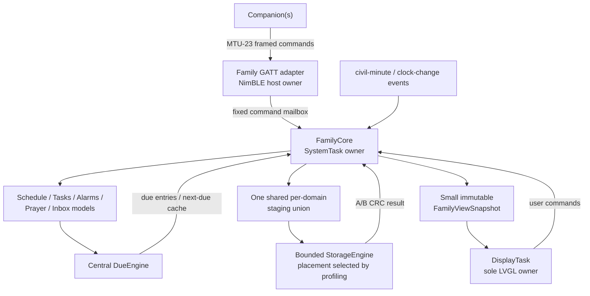
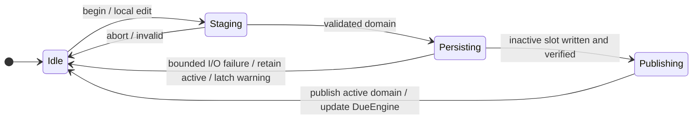
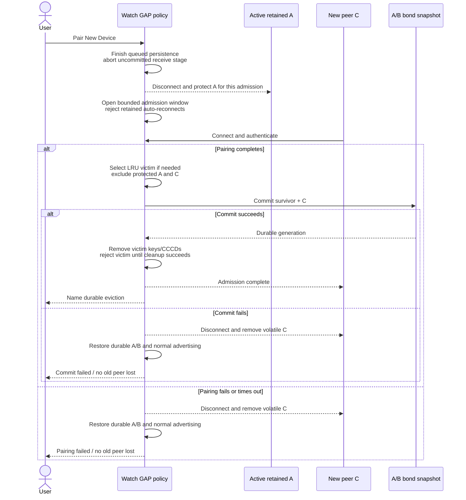
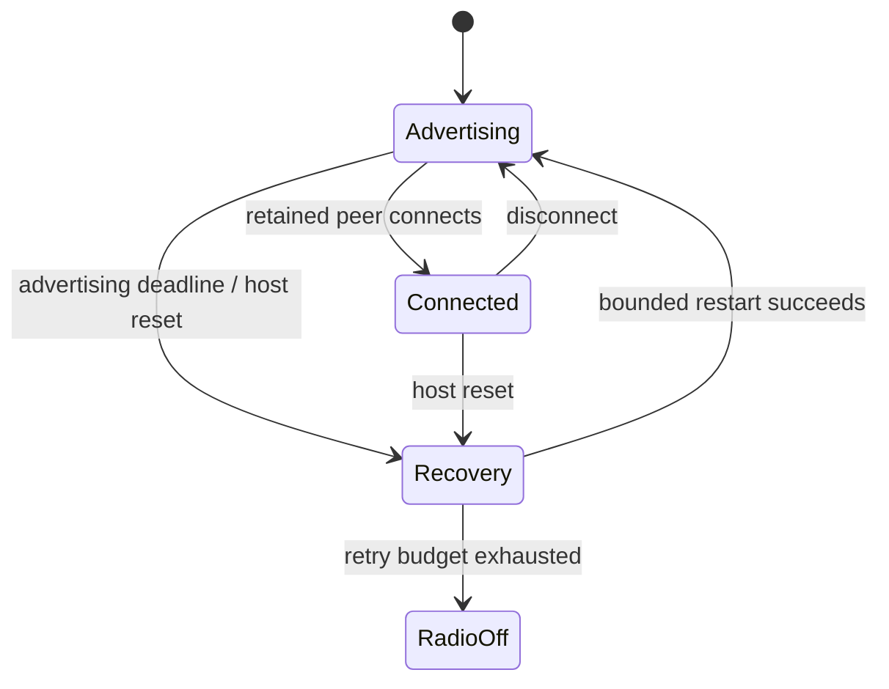

# Family firmware rewrite proposal

**Status:** design proposal for review; no firmware implementation has started
**Prepared:** 2026-08-10
**Clean baseline:** fork `origin/main` at `8d7a04e9` (including
`71d1f5b4 Keep external flash awake during AOD` and the display-init
correction)
**Design branch:** `family-rewrite`

> This branch starts from official InfiniTime, not from 2.x/3.x family-feature
> code. The old branch is evidence and a source of product requirements only.
> Code is adopted later only when it is small, independently tested, and proven
> to satisfy the new architecture and budgets.

## 1. Decision requested

I recommend a clean, staged rewrite with these product compromises:

- one active BLE connection;
- **two retained paired devices**;
- pairing a third device evicts the least-recently-used disconnected bond;
- schedule capacity 32, tasks 20, alarms 5, pending watch alerts 8;
- a compact Family face designed to a hard allocation budget, not a port of the
  current object-heavy face;
- no Find My beacon or other nonessential family feature in the first release;
- one multiplexed family GATT service rather than a service per feature;
- independent per-domain snapshots and no 8-KiB resident storage object;
- one central minute-driven due engine and no family-specific timers;
- no release until each feature passes separately on real hardware.

This preserves the killer features while deliberately reducing BLE and UI
complexity.

### Why this is a rewrite, not another 3.0.x patch

The old branch remains valuable evidence, but its failure was architectural:

- 3.0.3 had only **23,288 B** of raw FreeRTOS heap. The recovered 2.0.2 watch
  showed 23,256 B allocated at the photographed instant and 28,400 B at its
  recorded peak. Moving about 2.4 KiB of RTOS objects to static storage did not
  create a safe physical margin.
- The largest 2.0.2-to-3.0.3 linked-RAM increase was the 8,624 B StorageTask.
  It combined a task stack, duplicate state banks, and mutually exclusive
  scratch buffers into permanent RAM.
- The current Family face models at about 5.5 KiB and 172 live allocations,
  versus roughly 3.2 KiB and 111 for Digital. Stable weather could also trigger
  150--200 redundant label updates per second because of an equality defect.
- `Image OK` validated the application DFU transfer, not successful boot. The
  two green bootloader passes followed by 2.0.2 are most consistent with an
  MCUboot TEST swap, an early 3.0.3 reset, and automatic revert.
- The later 2.0.2 hours-long black state is likely a separate inherited
  display/SPI sleep-transition deadlock: DisplayApp can wait indefinitely while
  SystemTask continues feeding the watchdog. The Family/weather load is a
  credible amplifier, not proven sole cause.
- The upstream AOD flash-awake commit is important and is in this baseline. It
  prevents shared external flash from sleeping during AOD, but does not by
  itself explain either the 3.0.3 rollback or a Family face that mainly uses
  internal assets.

These conclusions are high-confidence mechanisms, not a claim that no-SWD
evidence can identify the exact failing instruction. The rewrite therefore
keeps the product behavior and test vectors, while discarding the coupled RAM,
task, persistence, BLE, and LVGL design.

### Measured RAM attribution

| Build | Raw FreeRTOS heap | Change | Principal explanation |
| --- | ---: | ---: | --- |
| Clean development main/fork point | 40,928 B | baseline | AOD fix adds no static RAM |
| Family 2.0.2 | 34,968 B | -5,960 B | embedded System/NimBLE +4,200 B; bond arrays +832 B; other linked growth about +920 B |
| Family 3.0.3 | 23,288 B | -11,680 B vs 2.0.2 | StorageTask +8,624 B; static RTOS objects +2,424 B; SystemTask +656 B; no-init +48 B; other -72 B |

In addition, 2.0.2 family features consume 2,112 B of persistent runtime
RTOS/GATT heap above linked-RAM loss. Its Family face models at 5,328 B / 167
allocations versus Digital at 3,240 B / 111; the later candidate Family face is
5,536 B / 172. These figures explain why the rewrite budgets linked, runtime,
and screen memory separately.

Removing launcher apps primarily saves **flash** and removes their worst-screen
runtime risk; it does not recover their full screen heap while they are closed.
The AOD flash-awake fix also needs current-consumption/battery measurement: it is
necessary correctness hardening, not free power-wise.

## 2. Product scope

### Required for the first complete release

1. **Scheduler**
   - recurring and one-shot local-time events;
   - browse upcoming events on the watch;
   - full-replace, interruption-safe companion synchronization;
   - reminders work without a phone after synchronization.
2. **Multi-alarm**
   - five alarms, with recurrence and snooze behavior selected during review;
   - local watch editing and companion editing;
   - all alarms share the central due engine; no alarm-specific RTOS timer.
3. **Tasks**
   - 20 daily tasks, locally checkable;
   - definitions synchronize through the companion;
   - daily completion and streak behavior is explicit and tested.
4. **Prayer times**
   - calculation on the watch from location/method/madhab/UTC-offset settings;
   - five prayer alerts plus sunrise display;
   - safe handling of polar/high-latitude cases;
   - local settings remain possible without the companion.
5. **Reliable notification and alert handling**
   - retain eight phone notifications in a bounded volatile ring;
   - independently retain eight watch-originated alarm/schedule/prayer firings
     in a compact durable ring;
   - a new arrival never silently replaces the alert the user is reading;
   - explicit acknowledge/dismiss semantics and an overflow indicator.
6. **Compact Family face**
   - time/date, next prayer, task completion, notification/pending-alert count,
     battery/charging/BLE/alarm/storage status, steps, and optionally weather;
   - update by event/minute, never by rewriting stable labels at 50 Hz.
7. **Lean product build**
   - remove nonessential games and demos from the default build.

### Explicitly deferred

- Find My/beacon support;
- more than two retained bonds;
- simultaneous BLE connections;
- arbitrary file-management changes;
- migration of blocked 2.x/3.x family-state files;
- signed firmware/key management (a separate product/security project).

### Recommended product profile

Proposed user-launcher whitelist: Schedule, Tasks, Prayer, MultiAlarm, Timer,
Stopwatch, Steps, Heart Rate, Music, and Weather. Keep the upstream core screens
that are not launcher options: Notifications, Flashlight, Quick Settings,
Settings, Firmware Update/Validation, Battery Info, Passkey, and Sys Info.

Exclude from the release launcher: Paint, Paddle, Twos, Dice, Metronome,
Calculator, Motion, and Navigation. Navigation is explicitly a review decision
because it is useful but uses external resources and is not central to this
product. Proposed watchface whitelist is Digital plus the new Family face;
Digital is first and is the safe fallback.

Removal is compile-time product configuration; it must not fork unrelated
upstream code. If persisted settings select an excluded app/face, startup must
fall back safely rather than dereference a missing implementation.

## 3. Safety invariants

These are release requirements, not aspirations:

1. The clock must render before optional BLE and family features start.
2. SystemTask may feed the watchdog only when required display/power progress is
   observable for the current power state. Boot/wake/expected renders require
   panel/frame ACK; acknowledged full sleep is healthy with System/RTC liveness;
   AOD is quiescent between scheduled renders but each requested render has a
   deadline. No mutex, queue, peripheral, filesystem, or readiness wait on a
   watchdog-feeding path may be unbounded.
3. A wake transition is acknowledged only after the panel command and a frame
   transfer complete. A queued wake message alone is not success.
4. A failed optional subsystem leaves a usable clock and records a diagnostic.
5. Family UI refresh, due evaluation, and recurrence calculations never read
   littlefs; they consume RAM views. Any retained upstream resource read uses a
   bounded filesystem/flash arbiter.
6. Littlefs has one serialization boundary, not necessarily one RTOS task.
   Family persistence has one state-machine owner and a bounded shared
   workspace; upstream Settings, FSService, bonds, and retained resource clients
   use the same arbiter so calls cannot overlap.
7. Durable state is never published before its CRC-protected replacement is
   committed. A failed write leaves the old active state intact.
8. BLE callbacks validate operation, chained-mbuf length, version, count, and
   every field before changing state. Family callbacks never touch flash.
   Retained DFU/FS callbacks may use only measured bounded/backpressured work;
   whole-slot erase, whole-image scan, filesystem GC, and other long operations
   run outside the NimBLE callback.
9. Every cross-task publication has a single owner or an explicit snapshot
   boundary; no unsynchronized `std::optional` or structure sharing.
10. Fixed capacities and bounded queues are visible product behavior. Overflow
    is counted and surfaced, never disguised.
11. The default release configuration alone defines the RAM gate; excluded
    faces/apps cannot be silently enabled in release CI.
12. A candidate is not eligible for deliberate MCUboot confirmation until it
    has drawn, initialized required storage state, and exposed usable
    diagnostics. Treat 7 seconds as the watchdog deadline until the actual
    installed bootloader register/version is recorded on-device.
13. One mount failure never auto-formats external flash. Retry/recovery may use
    defaults and read-only diagnostics; destructive reset requires an explicit
    user action or a separately reviewed multi-boot recovery policy.
14. FSService uses an explicit public-resource allowlist. It cannot read, list,
    write, remove, or rename family, bond/key, settings, firmware-control, or
    diagnostic namespaces; a global “FS enabled” toggle is not authorization.

## 4. Proposed architecture

### Ownership and tasks

- **SystemTask / FamilyCore owns all mutable family state.** BLE and DisplayApp
  post value-type commands to it. This avoids a controller-per-task design and
  removes cross-task state races.
- **DisplayTask owns all LVGL objects.** It reads compact immutable summaries or
  requests a copy; it never holds a pointer into a candidate bank.
- **NimBLE host owns connection, security, and bond-store mutations.** It parses
  packets into bounded value objects and posts commands. It does not write the
  filesystem synchronously from a GATT callback.
- **StorageEngine placement is a measured Phase 2 decision.** Encoding is
  incremental and uses a small buffer, but littlefs calls are synchronous and
  may perform multiple reads/programs/erases. Run them on SystemTask only if
  nearly-full/GC worst cases meet its control/watchdog service deadline. The
  fallback/recommended isolation is a compact static worker with a measured
  stack and the same shared staging buffer—not the previous 8.6-KiB object.
- **DueEngine** evaluates once when the civil minute changes, the clock jumps,
  or a model changes. It caches the next due minute. Alarm, schedule, prayer,
  and task rollover do not each allocate a FreeRTOS timer.
- **Cross-task queues contain fixed POD records.** A full mailbox returns an
  explicit `busy`/counter instead of blocking SystemTask or losing a critical
  wake transition.

### Mutation state machine

Only one durable family mutation is active. Returning `busy` is preferable to
holding a second full family snapshot or blocking BLE/SystemTask. The active
domain changes only after its inactive slot is durable and verified.

## 5. Data model and persistence

### Capacities proposed

| Item | Capacity | Rationale |
| --- | ---: | --- |
| Schedule rules | 32 | Existing product contract; adequate without expanded occurrences |
| Daily tasks | 20 | Existing product contract |
| Alarms | 5 | Fits the watch UI and shared DueEngine |
| Phone notifications | 8 | Roughly 0.9 KiB with 100-byte text; bounded and RAM-only |
| Watch-originated pending alerts | 8 | Compact frozen-title records; distinct firings never overwrite invisibly |
| Retained BLE peers | 2 | Major simplification and RAM reduction |
| Active BLE connections | 1 | Matches hardware/product interaction model |

Upstream currently retains five phone notifications. Eight costs only a few
hundred additional bytes and better matches the stated “do not miss a burst”
goal, so eight is the recommendation; the hardware RAM gate still has veto.

### Independent domain snapshots

Do not recreate the monolithic `FamilyState`. Each independently changed domain
has its own two-slot snapshot:

| Domain | Contents |
| --- | --- |
| `schedule` | rules and domain generation |
| `tasks` | definitions/order and generation |
| `task-day` | local date, completed stable task IDs, streak evidence |
| `alarms` | alarm definitions and generation |
| `prayer` | calculation/alert settings and generation |
| `due-state` | watch-alert ring plus per-source handled/presented ledger |
| `bonds` | two durable peer records, LRU metadata, allowed CCCDs |

Each slot uses an explicit little-endian header containing magic, domain,
schema version, payload length, monotonic domain generation, and CRC32. C++
object layouts are never serialized. To commit:

1. freeze one validated domain in the shared staging union;
2. stream the encoding to its inactive A/B slot through a small scratch block;
3. sync, read back the header/CRC, and close;
4. publish the new active RAM domain and generation only after verification.

Boot independently selects the newest valid A/B slot for each domain. A corrupt
prayer file therefore cannot erase schedules or tasks. Defaults are fail-safe by
domain: corrupt schedules load empty, alarms/alerts load disabled, and task-day
loads incomplete with a warning. **Due-state is special:** if both slots are
invalid while definitions remain, reminders stay suppressed with a sticky
warning; an explicit “resume reminders from now” action writes a current cutoff
before re-enabling them, so an empty ledger cannot replay old events. Files from
family 2.x/3.x are not imported; companion resync is safer for this small fleet.

### RAM and write semantics

There is one active decoded model per domain and one shared staging union sized
for the largest single domain. No second full family bank and no full encoded
copy are resident. Only one durable mutation may use the union at a time.

- Configuration and definition changes are durable-first: success is returned
  only after the inactive slot verifies.
- Phone notifications are intentionally volatile.
- With recommended durable watch alerts, a due event first commits one
  atomic `due-state` update containing its `unpresented` intent **and** handled
  watermark, then vibrates/displays, then records `presented`. Dismissal or ring
  overflow removes display history but not the bounded per-source watermark.
  On reboot an unpresented intent is presented again.
  This is **at-least-once** delivery: it avoids silent loss when storage works,
  but a reset between physical presentation and the `presented` commit can
  repeat the alert. Exact-once physical effects are impossible across that
  crash boundary. If the initial commit fails, present once from RAM, latch a
  storage warning, and make no reboot guarantee.
- Task tick durability is a review decision: immediate durable-first or a
  bounded two-second coalescing window with an explicit possible-loss contract.
- Encoding advances in bounded slices. Each physical flash operation and the
  aggregate synchronous littlefs call (including nearly-full garbage
  collection) must have a measured bound below its task's progress deadline.

Exact active/staging/scratch sizes must be proven with ARM `sizeof`, link maps,
stack-usage files, and runtime allocation telemetry before implementation is
accepted.

## 6. Feature behavior

### Central DueEngine

The engine runs only when the civil minute changes or when time/model data
changes. It computes a cached next-due minute and evaluates schedule, alarms,
prayer alerts, and task rollover together. Every firing receives a deterministic
occurrence key derived from source ID and intended local occurrence. This makes
simultaneous events append independently and deduplicates pending records across
clock changes/reboot. The physical vibration follows the explicitly documented
at-least-once policy above rather than promising impossible exact-once delivery.

Occurrence identity is `(source type, stable ID, definition revision, intended
civil occurrence)`. Stable IDs are not reused for a semantically new rule, and
time/recurrence edits increment revision. The same `due-state` A/B commit stores
the visible pending record and a bounded last-handled watermark for every active
schedule/alarm/prayer source; dismiss/overflow cannot erase duplicate evidence.

The initial implementation uses the existing 100-ms SystemTask cadence after
Phase 1 hardens its current unbounded DateTime/mutex waits, so it does not arm a
months-long FreeRTOS timer. If profiling later justifies a static one-shot
timer, each arm is capped at 24 hours (the 32-bit/1024-Hz tick range is only
about 48.5 days), every timer command is checked, and clock/model changes force
re-evaluation.

Forward clock jumps and downtime need one explicit product rule. The proposed
default is: fire occurrences up to ten minutes late, summarize older missed
occurrences visibly without vibration, and never emit a storm. This remains a
decision for review.

### Scheduler

Retain rule-based storage rather than expanded occurrences:

- one-shot;
- every N days;
- weekly weekday mask;
- monthly day with end-of-month clamp;
- inclusive optional end date;
- local watch time, governed by the reviewed missed-occurrence/grace rule.

Sync uses begin / sequential chunks / commit / abort. The active list changes
only after the committed snapshot is durable. Capabilities expose schema,
capacity, count, generation, and content checksum. The companion reads the
watch generation, merges stable record IDs against its last base, then performs
a compare-and-swap replacement. The watch is authoritative but does not
allocate a merge engine.

### Tasks

Definitions use stable IDs and full-replace transactional sync; rename/reorder
must preserve today's completion. A separate `task-day` domain contains the
local date, completed stable IDs, and streak evidence. UI intersects those IDs
with current definitions, so reorder needs no cross-domain commit and deleted
IDs can be cleaned idempotently. Whether a tap is immediately
durable or coalesced for at most two seconds is unresolved; silently clearing
today's ticks on reboot is not the recommended default. At local-day rollover,
compute streak and clear completion through a deterministic transaction. Clock
corrections and multi-day downtime require explicit pure rules and tests.

### Multi-alarm

Five fixed records use versioned compare-and-swap updates. Watch edits and
companion edits share the same command path. The review must choose exact
recurrence (one-shot date, daily, selected weekdays), snooze duration/count,
labels, and missed-alarm behavior. A completed one-shot auto-disables through a
durable mutation. Recovery reconciles a durable alert intent with the alarm's
enabled state idempotently: a handled Once revision that is still enabled is
suppressed and its disable write retried before scheduling. If storage is
unavailable, duplicate suppression is only guaranteed for the current boot and
the warning stays visible.

### Prayer

Use a pure calculation library with no LVGL/RTOS/filesystem dependencies.
Inputs are validated fixed-point coordinates, method, madhab, alerts, and a
persisted UTC offset. DST remains a companion/local-settings update, not an
implicit network dependency. High-latitude and polar rules need golden vectors
and property tests before any UI is added.

### Notifications and pending alerts

Use two intentionally different rings under one inbox UI:

1. **Phone notification ring:** eight fixed 100-byte text records, source peer,
   category, 32-bit ID, received time, and seen state. It is volatile across
   reboot (the current ARM representation is 112 B per record, so eight records
   are 896 B, 336 B more than upstream's five-record array).
2. **Watch alert ring:** eight compact durable records containing occurrence
   key, source, fired time, and a bounded frozen title. Later edits therefore
   cannot make a pending alert ambiguous.

An automatic preview never marks an item seen. Opening/browsing it marks seen;
only explicit acknowledge/dismiss removes it. A new arrival while the user is
reading appends without replacing the current item. On overflow, evict the
oldest seen item first. If all are unseen, evict the oldest unseen item but
retain a visible dropped-count marker so loss is never silent. The entry being
displayed is pinned until the screen leaves it; another eligible item is chosen.

A single alert presenter owns vibration and the full-screen alert. Sources never
launch competing screens. The face shows both phone-notification and pending
watch-alert unseen counts. Incoming calls may take presentation priority but
must not destroy older entries. Local dismissal removes only watch history in
the first release; it does not claim to dismiss the phone-side item unless that
specific transport action is implemented and tested.

## 7. Family BLE protocol

Replace the old collection of family-specific GATT services/characteristics
with one multiplexed Family service. This does **not** replace upstream DFU,
current time, phone-notification, music, heart-rate, or other standard services.

Recommended characteristics:

| Characteristic | Security | Purpose |
| --- | --- | --- |
| Capabilities | public read | protocol/schema versions, capacities, feature bits |
| Command | encrypted/authenticated write-with-response | begin/chunk/commit/abort/read commands |
| Response | encrypted/authenticated read | bounded response chunks and errors |
| Status | encrypted/authenticated read | transaction state, generation, progress, warning |

The companion polls Status during infrequent synchronization, avoiding another
notification CCCD per bond. If real profiling shows polling harms usability or
power, one status notification can be reconsidered with its RAM/persistence
cost measured.

Protocol invariants:

- it works at the default ATT MTU 23; no packet assumes more than 20 bytes of
  ATT value payload;
- every multi-packet transfer carries transaction ID, sequential offset, total
  length, domain/schema, and whole-payload CRC;
- the transaction is bound to the authenticated peer that began it, has a
  bounded lease (proposed 30 seconds between chunks), and cannot be resumed by a
  different connection;
- begin, chunk, commit, abort, and read-domain are explicit operations;
- commit uses expected domain generation (compare-and-swap), and firmware
  assigns the next generation;
- states are `receiving`, `validating`, `persisting`, `applied`, or `failed`;
- disconnect discards only uncommitted receive staging; queued persistence
  continues to its deterministic result;
- a bounded current-boot result cache answers duplicate completed transaction
  IDs idempotently rather than reapplying. After reboot, the companion resolves
  a lost commit response by reading domain generation plus content checksum;
  transaction IDs themselves are not promised durable. Abandoned receive
  staging cannot starve local alarm/task/rollover persistence;
- unknown operations/versions, invalid lengths/counts/enums, duplicate or
  out-of-order chunks, trailing bytes, and malformed UTF-8 are rejected before
  model mutation;
- the canonical schema generates firmware, simulator, companion, and protocol
  test artifacts so capacities cannot silently diverge again.

Multi-phone conflict policy is optimistic concurrency, not last-writer-wins:
each companion reads generation/data, performs a stable-ID three-way merge
against its own last synchronized base, then commits with the expected watch
generation. A stale commit returns `conflict`; it never overwrites newer watch
data.

## 8. Two-peer BLE policy

“Two devices” means **two retained bonds**, not simultaneous connections.

Recommended explicit admission sequence:

Radio recovery is a separate bounded state machine; an advertising deadline is
not incorrectly attributed to a connected state:

Rules:

- Retain clean main's existing three in-memory bond slots. Product policy
  persists only two peers; the third slot exists transactionally while
  admitting a replacement. Clean main's `/bond.dat` persists only one peer, so
  that persistence path must be replaced rather than extended accidentally.
- Inventory all subscribing upstream services. Clean main permits eight total
  CCCD records. Two durable peers can require 16 (eight each), while A/B/C can
  transiently require 24 if C subscribes immediately before victim cleanup.
  Provision 24 in-memory entries and persist at most the surviving 16 unless
  tests prove a smaller admission-safe bound; the polled Family status
  characteristic adds no CCCD.
- Advertising remains undirected, connectable, and discoverable regardless of
  whether zero, one, or two bonds exist. Do not whitelist retained peers. Fast
  advertising may transition to slow advertising, but slow advertising
  continues indefinitely.
- New bonding and any eviction require an explicit on-watch **Pair New Device**
  window/confirmation. An unknown phone reconnecting in the background cannot
  churn the LRU set.
- Because only one connection is supported, Pair New first finishes already-
  queued persistence, aborts uncommitted sync, and disconnects the active peer.
  That just-disconnected peer is protected from eviction for this admission.
  During the bounded admission window, retained phones that auto-reconnect are
  disconnected so C can connect; cancel/timeout restores normal advertising.
- Outside Pair New, an unknown or stale-key connection is disconnected as soon
  as identity/authentication fails and always within a proposed 10-second
  authentication deadline. It cannot occupy the only slot indefinitely, change
  LRU, or alter durable peers; advertising resumes afterward.
- Never evict the currently connected peer or the peer being admitted. Choose
  the least recently **authenticated/used** disconnected peer; an unauthenticated
  connection does not refresh LRU.
- Admission occurs only when both halves of the new bond exist; do not evict on
  the earlier encryption-change callback.
- Replace NimBLE's default store-full round-robin behavior; it must not unpair a
  retained peer before C has completed and the replacement can be committed.
- With durable A/B and new C present, atomically persist `{survivor, C}` before
  deleting the victim. If persistence fails, disconnect and remove C from
  volatile storage, retain durable A/B, notify the user, and make the next boot
  deterministic. After successful persistence, the durable registry is
  authoritative: if volatile victim-key/CCCD deletion fails, reject that victim
  and retry cleanup rather than allowing a hidden third peer.
- Advertising always resumes after disconnect, failed connect, pairing failure,
  host resync, and eviction. A bounded radio state machine owns GAP calls;
  SystemTask never waits for advertising synchronously.
- Provide on-watch `Forget all paired devices` and a small status page: `n/2`,
  eviction count, last persistence result, advertising/recovery state.
- Pairing a third phone should show “oldest paired device removed” after the
  replacement is durable and name the victim when a trustworthy name exists.
  No remote unpair-by-identity API is required for the first release.

A simpler alternative is “reject the third and require Forget All.” I do not
recommend it because it fails the requested seamless behavior.

## 9. Compact Family face proposal

The present face models around 5.5 KiB and 172 live allocations in the current
candidate. It should not be ported as-is.

Digital remains the initial default and recovery fallback. The new face is
added only after the underlying features pass their own gates. Its proposed
information priority is:

1. time and date;
2. next due family event and time/countdown;
3. next prayer and time;
4. today's completed/total tasks;
5. unseen phone/watch-alert counts;
6. battery/charging/BLE/alarm/storage-warning status;
7. steps, with weather optional.

The exact mandatory rows and tap/swipe destinations are review decisions. AOD
shows time/date, next due event, and critical status only; it does not animate,
read flash, or continually reformat hidden fields.

Design the implementation around a fixed object budget:

- one root/background;
- one status-row container with a single composed status label plus battery
  primitive;
- one time label and one AM/PM label;
- one composed next-event/prayer region;
- one date/activity row with at most three labels;
- one composed task/steps/weather row;
- fixed class-owned character buffers; update label text only when content
  changes;
- refresh minute-dependent fields once per minute and event-driven fields only
  on controller generation changes;
- AOD uses a deliberately reduced render contract, with no flash-backed asset.

**Proposed gate:** no more than 2,800 physical heap bytes, no more than 100 live
allocations, zero allocation count growth over a 24-hour simulated refresh, and
the global largest-block floor on hardware under connected/storage/AOD stress.
Screenshot tests cover maximum text, counts, temperatures, 12/24-hour formats,
RTL/UTF-8 truncation policy, warnings, inbox overflow, and AOD. Visual
equivalence with the old face is not required; information hierarchy is.

Weather should be optional on the face. If retained, first upstream/harden the
known equality, mbuf-length, timestamp, and cross-task-publication defects, and
consume a compact immutable weather summary.

## 10. RAM and reliability budgets

Measured clean-main raw heap is 40,928 B (40,920 B heap_4-usable). Its complete
MCUboot image is 386,248 B against the 474,704 B application-image boundary,
leaving 88,456 B. Treat both as budgets to preserve, not invitations to fill
RAM/flash.

Proposed release budgets (to be verified and adjusted after baseline profiling):

| Budget | Gate |
| --- | ---: |
| Permanent linked/static growth over clean-main baseline | <= 5 KiB |
| Resulting raw FreeRTOS heap | >= 35,808 B |
| New persistent runtime heap over clean-main baseline | <= 1 KiB |
| Compact Family face physical heap | <= 2.8 KiB |
| Complete MCUboot app image | <= 420,000 B |
| Minimum-ever free heap after full combined stress | >= 8 KiB |
| Largest allocatable block after returning to clock | >= 6 KiB |
| Task stack high-water reserve | >= 128 B and >= 20% |
| Unexpected malloc/stack/I/O deadline failures in nominal/stress runs | 0 |
| Unexplained free-heap drift during 24-hour stable workload | <= 256 B |
| Touch feedback / ordinary durable completion | <= 100 ms / normally <= 2 s |
| Full-sleep / AOD current regression vs clean main | <= 5% / <= 10% |
| Family filesystem writes while idle | 0 |

These are provisional release gates, not predictions. Measure clean main and
the official-release control first; any unavoidable baseline behavior is
documented explicitly.
The old branch's 3,464-byte optimistic coalesced floor was too close to release
safely. The rewrite must recover a materially larger physical margin, not
merely rearrange static and heap bytes.

The component ceilings are early rejection tests, not an additive proof. The
final equation is measured on target for each scenario:

`raw heap - baseline runtime - new persistent runtime - active screen - maximum
transient overlap = observed free/largest blocks`.

The combined gate includes encrypted BLE, maximum records, full inbox, Family
face, HR, storage commit, app churn, and AOD/sleep transitions. It also repeats
third-phone admission at the transient peak (A/B/C security plus 24 CCCDs) while
those features are resident, or proves an equivalent measured overlap cannot
occur. All individual limits may pass while this scenario still fails.

Every phase records `.data`, `.bss`, `.noinit`, raw heap, runtime boot free/min,
largest block, object allocations, and task high-water marks. A feature that
breaks the phase budget is redesigned before the next feature begins.

### Boot and recovery behavior

The safety foundation precedes all family features:

1. capture reset reason, boot stage, and watchdog configuration before they can
   be overwritten;
2. bound clock, SPI, TWI, panel, filesystem, queue, and BLE waits;
3. guarantee System/Display task and queue storage before optional allocation;
4. produce and acknowledge a complete first clock frame before initializing
   NimBLE or family features;
5. load each family domain independently, retaining a warning for a defaulted
   corrupt domain;
6. feed the watchdog only while the state-specific System/display health
   contract in Section 3 is satisfied;
7. keep manual MCUboot confirmation unavailable until sustained liveness and
   diagnostics pass; retain the upstream Firmware Validation screen and do not
   auto-confirm immediately after boot;
8. for an already-confirmed image, three consecutive unclean early WDT/fatal
   warm resets before the stable-runtime checkpoint enter a recoverable safe
   mode: Digital face, AOD off, and family reminders disabled. The clock is
   mandatory; BLE diagnostics
   and DFU are attempted only if BLE and the raw OTA flash partition pass
   bounded health checks. A CRC-protected `.noinit` attempt record is cleared
   only after a proposed ten minutes of stable runtime or explicit recovery. It
   is not claimed to survive power loss. Intentional DFU activation, user/recovery,
   and deliberate-test resets set a marker and do not increment the counter.
   An unconfirmed TEST image instead reverts on its first reboot, as MCUboot
   intends.

A littlefs-only mount failure enters degraded clock operation without formatting
the filesystem; raw-partition DFU remains available only if bounded physical
flash read/erase/program health checks pass. Whole-media/SPI failure cannot
promise DFU. The diagnostic must distinguish mount, media, CRC, and per-domain
schema failures.

BLE failure must leave an offline watch. Storage failure must preserve the prior
domain. Display failure must reset/revert rather than remain black indefinitely.

## 11. Staged delivery and gates

No “all features then test” integration. This is a future execution plan only;
no phase begins until this proposal and its decision sheet are approved.

### Phase 0 — Official baseline characterization

- establish reproducible clean builds, images, simulator, host tests, map files,
  and telemetry from `8d7a04e9`;
- physically soak official released 1.16.1 as the stable control, then measure
  the clean-main development baseline;
- record the installed bootloader version/watchdog configuration and full-sleep/
  AOD current draw with external flash behavior identified.

**Gate:** no family code; official behavior works; 100 boot/wake cycles;
24-hour control soak; exact RAM, stack, image, and reset baselines recorded.

### Phase 1 — Platform safety foundation

- independently implement only bounded drivers, first-frame boot ordering,
  display transition ACK/heartbeat, sticky diagnostics, and safe mode;
- fix MCUboot confirmation detection to use the alignment-one low-byte
  `image_ok` semantics rather than clean main's incorrect four-byte equality;
- audit retained DFU and FSService so NimBLE callbacks cannot synchronously run
  whole-slot erase/validation or unbounded littlefs work; preserve protocol
  backpressure and update compatibility;
- retain the upstream AOD external-flash fix;
- port weather fixes only with their focused regression tests;
- add no scheduler, task, alarm, prayer, face, or family BLE feature.

**Gate:** inherited behavior still works; injected LCD/SPI completion loss causes
a diagnosed reset/revert rather than a black hang; 100 boot/wake/AOD cycles and
a 24-hour soak pass within the RAM and current-regression budgets.

### Phase 2 — Pure core, persistence, and protocol skeleton

- schedule/task/alarm/prayer pure types and algorithms;
- per-domain codecs and incremental A/B StorageEngine;
- generated MTU-23 Family protocol and simulator bridge;
- no user-visible feature and no new watchface yet.

**Gate:** normal + ASan/UBSan host tests, fuzz/property tests, corrupted/truncated
slot matrix, simulated power loss at every program/sync/publish step, protocol
generation parity, and ARM size/RAM budgets pass.

### Phase 3 — Two-peer pairing policy

- explicit Pair New Device journey, durable two-peer registry, third-slot LRU
  admission, on-watch status/Forget All, and bounded radio recovery;
- no family synchronization beyond protocol diagnostics.

**Gate:** pair/use A/B across reboot; pair C while A/B phones are nearby and
evict deterministic LRU; stale keys cannot churn bonds; power loss at every
replacement step preserves either the old or new valid pair; advertising
recovers after failure; C immediately writes every supported CCCD without early
victim eviction/store-full; Pair New while A is connected protects A; 100
reconnect cycles pass.

### Phase 4 — Scheduler, DueEngine, and inbox vertical slice

- scheduler BLE transaction, companion support, upcoming list, central
  DueEngine, watch-alert ring, and shared alert presenter;
- harden upstream phone notification history into the same inbox UX without
  changing its standard transport service.

**Gate:** maximum 32 records, interrupted/conflicting sync, clock change/reboot/
grace semantics, simultaneous firings, eight-notification burst, ninth-item
overflow while reading, recurrence vectors, and a 24-hour reminder soak pass.

### Phase 5 — Multi-alarm and tasks

- five alarms and compare-and-swap editing;
- task definitions, daily completion, rollover, and streak;
- shared inbox handles simultaneous alarm/schedule firings.

**Gate:** reviewed alarm recurrence/snooze behavior, midnight/date jumps,
reboot semantics, task definition changes with existing ticks, maximum sync,
persistence failures, and the phase RAM budget pass.

### Phase 6 — Prayer

- calculation/settings, list UI, individual alert options, and DueEngine
  integration.

**Gate:** authoritative geographic/date vectors, all supported methods/madhabs,
DST offset changes, high-latitude/polar boundaries, collisions with other due
events, and a multi-day soak pass.

### Phase 7 — Compact Family face and lean product profile

- approve a wireframe/screenshot contract before implementation;
- implement the fixed-budget face;
- apply the exact reviewed app/watchface whitelist.

**Gate:** screenshot/extreme-value matrix, touch/navigation and fallback paths,
allocation-count stability, AOD/full sleep, notification/task/prayer changes,
repeated face/app churn, and physical largest-block threshold pass.

### Phase 8 — Release candidate

- full companion + simulator parity and clean committed build with exact SHA;
- MCUboot TEST swap, forced failure/revert, and deliberate-confirm trials;
- maximum data plus combined BLE/storage/UI/AOD stress;
- 100 boot/update cycles, a 72-hour stress run, and then a seven-day soak before
  prerelease.

## 12. Test strategy

- **Pure host tests:** recurrence, day rollover, prayer math, codecs, ring
  behavior, conflict/version rules, bond eviction policy.
- **Sanitizers/fuzzing:** every external packet and persisted file; equality and
  extreme signed/unsigned values; malformed UTF-8 is rejected or truncated only
  at a valid code-point boundary.
- **Deterministic fault injection:** allocation failure at every feature
  boundary; queue full; timer command failure; filesystem short read/write;
  SPI/TWI completion loss; BLE no-sync; dropped wake/sleep messages.
- **ARM parity:** compile and run representation/golden-vector tests against
  target-sized types; inspect `.map`, `.su`, image vectors, and MCUboot bounds.
- **Simulator GUI:** real generated protocol messages and persisted images;
  screenshots at all extreme layouts; long refresh/allocation stability.
- **Real watch:** official-baseline control first, then one feature phase at a
  time. Record free/min/largest heap, task HWM, boot diagnostics, SPI timeout
  counters, reset reason, and BLE state after every stress pass.

Mandatory end-to-end journeys include:

- eight phone notifications arrive while asleep and remain browsable in order;
- a ninth arrives while the oldest is displayed: displayed text does not change
  underneath the user and loss is counted visibly;
- schedule, alarm, and prayer fire in the same minute and remain separate;
- reset immediately before/after a due event never produces an unexplained
  duplicate or silent loss;
- complete tasks, reset, cross midnight, and edit/reorder definitions while
  preserving exactly the reviewed tick/streak semantics;
- pair A/B, then explicitly pair C while A/B are nearby; only the deterministic
  LRU peer is evicted and stale keys cannot trigger another eviction;
- boot with a previously selected app/watchface that is excluded by the product
  profile and fall back safely to Digital.

## 13. What is reused versus redesigned

### Reuse as requirements and pure-test vectors

- scheduler recurrence semantics and record layout ideas;
- task semantics;
- prayer calculation rules and vectors;
- multi-alarm behavior;
- pending-alert user interaction;
- lessons from the protocol generators and companion implementation;
- boot/DFU/SPI/weather defects and their regression tests.

### Redesign rather than copy

- StorageTask and dual full-state banks;
- five-peer bond registry and 40-CCCD footprint;
- cross-controller persistence choreography;
- current Family LVGL object graph and 50-Hz polling;
- broad 3.0 “fix everything at once” diff;
- any code whose only proof is simulator success.

## 14. Review questions

The detailed response template is in [`DECISIONS.md`](DECISIONS.md). The most
important product choices are:

1. confirm two durable peers / one active connection / explicit third-phone LRU
   replacement;
2. approve eight volatile phone notifications and decide whether eight local
   watch alerts survive reboot;
3. approve scheduler recurrence plus the late/missed-event grace rule;
4. select exact alarm recurrence and snooze behavior;
5. choose immediate versus two-second-coalesced persistence for today's task
   ticks;
6. approve the Family-face wireframe, AOD content, weather inclusion, and
   whether Family becomes the release default;
7. approve an exact app and watchface whitelist;
8. decide clean family-data/bond cutover, required companion platforms, and the
   new version line (recommended `4.0.0-alpha.1`, never another 3.0.3 artifact).

## 15. Evidence and provenance

- Development baseline: fork/upstream-derived `main` `8d7a04e9`; AOD fix
  `71d1f5b4`; equivalent display-init fix `8a9ccf21`.
- Official released control: tag `1.16.1` at `e172b9b3` on its hotfix line.
- Failed family references: `v2.0.2` at `c8f2980e` and `v3.0.3` at `743728d5`.
- RAM/image values come from clean ARM ELF/map/image accounting and the detailed
  analyses preserved on `family-features` as
  `doc/family-features-ram-analysis.md` and
  `doc/3.0.3-boot-incident.md`.
- The recovered-watch runtime values come from the user's 2026-08-09 Sys Info
  photographs. Those pages prove reset/heap/task/radio fields; the reported
  2.0.2 version comes from the user's direct observation, not visible text in
  those four photographs.
- All future numerical limits labeled “proposed” remain hypotheses until Phase
  0/physical measurements close their gates.

## 16. Current state

The `family-rewrite` branch exists from clean fork `origin/main` at `8d7a04e9`.
That development baseline still reports version 1.16.0, while official released
1.16.1 is the recommended watch recovery/control image; main contains the
equivalent display-init correction plus newer commits including the AOD fix.

Only planning/documentation changes are intended on this branch now. No
firmware feature code has been copied or implemented, no image has been built,
and no artifact should be flashed. The old `family-features` branch remains
preserved for incident evidence and test-vector extraction; 3.0.0--3.0.3 remain
blocked.
