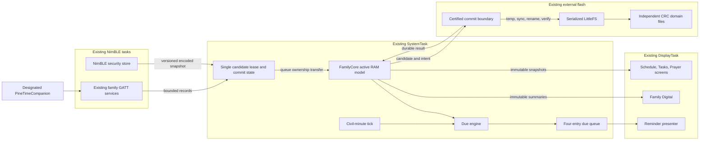
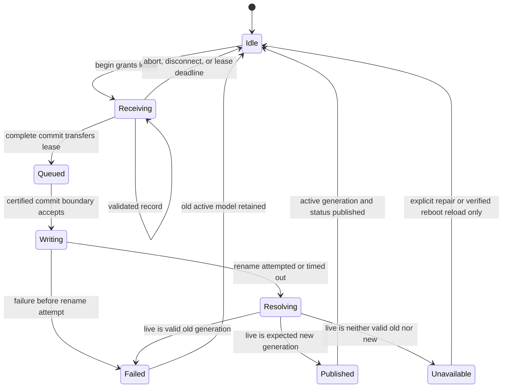
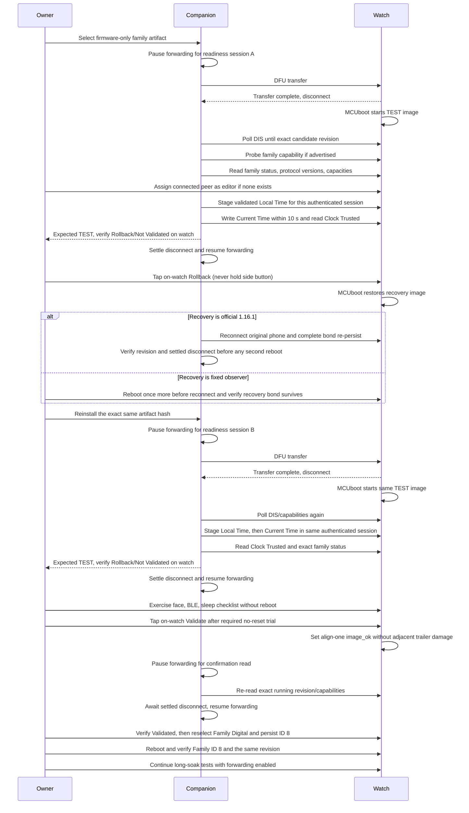

# Minimum-change family firmware proposal

<!-- markdownlint-disable MD013 MD024 -->

**Review state:** engineering proposal; no firmware implementation authorized
**Prepared:** 2026-08-10
**Base:** development main `8d7a04e9`
**Companion under review:** PineTimeCompanion `be24759`
**Detailed decisions:** [DECISIONS.md](DECISIONS.md)
**Evidence and experiments:** [EVIDENCE.md](EVIDENCE.md)
**Testable requirements:** [REQUIREMENTS.md](REQUIREMENTS.md)

## 1. Executive recommendation

Do not patch 3.0.3 and do not restart InfiniTime from scratch. Build the family
product as a sequence of small integrations on current main:

1. correct the companion's official-firmware read/update journey;
2. characterize the official 1.16.1 watchdog incident;
3. flash a zero-family diagnostic main baseline;
4. introduce individually gated liveness fixes;
5. add two-peer replacement;
6. add scheduler, tasks, prayer display, then Family Digital one at a time;
7. combine them only after each physical slice has passed.

The complete first release is intentionally limited to:

- up to two durable paired phones, one connected at a time, and safe third-phone
  replacement;
- scheduler sync/list/recurrence/reminders;
- daily task sync/list/durable checks;
- prayer settings/calculation/list/next-time display;
- a compact Digital-derived family watchface.

Upstream Alarm, phone notifications, apps, watchfaces, DFU, and existing
resource reads stay in place. Remote BLE resource upload is disabled in the
first family RC because no minimum feature needs it and it is the largest
nonessential NimBLE-host filesystem surface implicated by the official
incident. Multi-alarm, notification history, task streaks, prayer alerts, Find
My, app pruning, multi-editor guarantees, weather on Family Digital, and
Family AOD are deferred under the owner's latest minimum set.

This plan cannot honestly guarantee a first flash without physical evidence.
It targets the highest practicable confidence, conditional on representative
spare hardware and every gate passing, by preventing the previous failure pattern:
large coupled changes, insufficient RAM, unbounded waits, mismatched companion
contracts, resource uploads that are not needed, and validation before health
is known.

## 2. What the incidents establish

### 2.1 3.0.3 was not merely “a little low on memory”

Reproducible ARM links show:

| Image | Linked RAM | Raw FreeRTOS heap | Change from main |
| --- | ---: | ---: | ---: |
| Development main / official 1.16.1 | 23,584 B | 40,928 B | — |
| Family 2.0.2 | 29,534 B | 34,968 B | −5,960 B heap |
| Family 3.0.3 | 41,214 B | 23,288 B | −17,640 B heap |

3.0.3 made `storageTask` an 8,624 B static object and grew `systemTask` from
2,912 B to 7,768 B. A 2.0.2 hardware photograph records a minimum-ever free
heap of 6,568 B from a 34,968 B total. Applying the same observed demand to
3.0.3 exceeds its raw heap by about 5.1 KiB. Different allocation order or
static task conversion does not create adequate margin.

The two green MCUboot passes followed by 2.0.2 strongly indicate a TEST image
that reset before confirmation and was reverted. The photographed 2.0.2 System
Info later reports `softr`; reverse-swap completion itself makes that expected
and it provides essentially no evidence about the candidate's first failure.
The counterfactual demand replay is not proof of the exact allocation sequence,
but the 5.1 KiB modeled deficit and tiny raw headroom make 3.0.3 an
unacceptably high-confidence memory-margin defect. The exact first reset is not
known.

### 2.2 The 2.0.2 black state is not diagnosed

A black watch for hours can mean DisplayTask/panel/shared SPI is stuck while
SystemTask remains alive and feeds the watchdog. It can also mean reset cycling
or another peripheral failure. There is no contemporaneous reset reason. The
old code's unbounded SPI/flash waits and larger Family-face allocation surface
are credible, but the plan does not label either as the proven cause.

### 2.3 Official 1.16.1 exposed a separate liveness defect

The first companion error after re-check is understood: it successfully reads
DIS and then unconditionally reads a family characteristic that official
1.16.1 does not implement. A top-level Re-read uses only DIS. Neither operation
requests a watch reset.

The later `wtdg` means the sole watchdog-feeding SystemTask missed a seven-second
deadline. That is unacceptable and cannot be explained as an ordinary slow
read. The clearest sequence-correlated feeder path is the blocking
`BleConnected` → Display activity post. Other direct sinks include TWI/DateTime
lock paths immediately before reload and shared SPI/flash hard waits;
unsynchronized LittleFS/resource traffic can supply the initiating corruption
or contention. Rapid companion disconnect/reconnect behavior is a credible
trigger, not a root-cause substitute. See EVIDENCE §§2–4.

### 2.4 The upstream AOD flash commit matters, but is not a diagnosis

Main includes `71d1f5b4`, which keeps external flash awake while AOD continues
rendering. The official incident probably occurred with AOD off. The commit is
still a necessary main-base correction for upstream faces; Family Digital will
use full sleep in its first release and therefore not depend on Family AOD.

## 3. Design constraints

### 3.1 Non-negotiable safety properties

- A failure in BLE or family data must not prevent the clock UI from starting.
- No finite startup/operation/transition with expected completion may wait
  forever for a peripheral, mutex, queue, LVGL call, or readiness flag. Healthy
  idle owner loops may block awaiting new work.
- The watchdog remains a detector; it is not fed to conceal an unbounded I/O
  operation and is not lengthened.
- A single mount or I/O failure never formats external flash.
- A new phone cannot evict either durable phone until its replacement snapshot
  is durable.
- A family mutation is visible only after its CRC-protected file is durable.
- Display and recurrence paths use RAM snapshots, not filesystem reads.
- No general feature task is added. Target zero new RTOS tasks; exactly one
  measured compact I/O executor is allowed only through D4 if SystemTask's
  recursive stack or complete transaction latency cannot be certified.
- The first family artifact does not require a resource upload.
- Family qualification/first-RC builds do not expose BLE filesystem writes.
- MCUboot TEST/revert remains available until deliberate owner validation.

### 3.2 Change-minimization rules

- Preserve upstream behavior by default.
- Port a historical helper only with its focused tests and a fresh clean-base
  review; never cherry-pick the old feature stack wholesale.
- One architecture change per physical gate.
- Measure linked RAM, raw heap, runtime heap, largest block, and task stacks at
  every slice.
- A timeout must return ownership and a typed error; “give up” without cleanup
  is not bounded behavior.
- A simulator result is necessary but never substitutes for PineTime behavior.

## 4. Product contract

### 4.1 Included

| Capability | First-candidate contract |
| --- | --- |
| Pairing | Up to two durable authenticated peers, one active link, explicit two-minute Pair New Phone mode when full, LRU replacement only after durable commit, Forget All |
| Scheduler | 32 records; one-shot/every-N-days/weekly/monthly; optional inclusive end date; read-only watch list; reminder queue |
| Tasks | 20 definitions; companion edits list; watch toggles today's checks; checks survive reset; clear on local date change |
| Prayer | Five calculation methods, two Asr choices, coordinates/offset from companion, list and next prayer/window |
| Family Digital | Time/date, status icons, next schedule, next prayer, task count, notification indicator; internal assets; per-profile full sleep |
| Companion | One designated family-data editor; official/recovery and family capability profiles; commit/readback verification |

### 4.2 Deferred without placeholder code

- simultaneous BLE connections or more than two retained peers;
- per-peer names/removal or selected-phone handoff;
- notification history or durable unified inbox;
- multi-alarm;
- task streak/history/parent override;
- prayer vibration alerts unless the owner promotes them as a separate slice;
- on-watch schedule/task/prayer editors;
- multi-editor merge guarantees;
- Find My/beacon behavior;
- Family weather, heart rate, steps, and alarm summary;
- Family AOD;
- BLE resource upload in the first family RC;
- app/watchface pruning;
- old family-data migration.

## 5. Minimum architecture

There is no old `StorageTask`, model-owning family worker, new feature task, or
per-feature FreeRTOS timer. The commit boundary executes on SystemTask only if
its recursive stack and end-to-end latency are certified before hardware. If
not, D4 permits one compact fixed I/O executor that borrows the shared buffer
and owns no model bank. Existing NimBLE and Display tasks never run family
filesystem operations.

### 5.1 Ownership table

| State/resource | Writer | Readers | Synchronization rule |
| --- | --- | --- | --- |
| Active schedule/tasks/prayer | SystemTask only | SystemTask, BLE copy-out, Display snapshot | Publish generation after durable commit; readers copy a bounded snapshot |
| Candidate buffer | Lease owner: NimBLE host or SystemTask UI, then SystemTask | None until publish | State transition transfers exclusive lease through queue/critical section |
| Family files | Certified commit boundary (SystemTask or D4 compact executor) | SystemTask at boot only | Complete LittleFS transaction lock; no Display/BLE family access |
| NimBLE security store | NimBLE host task | NimBLE host capture | Capture stable encoded values; commit boundary persists copy |
| LVGL objects | DisplayTask only | DisplayTask | Existing LVGL ownership retained |
| Due cursor/queue | SystemTask only | Display gets queue messages/snapshots | Fixed data, non-blocking/coalesced notification |

### 5.2 Candidate transaction state

Only one transaction is active across all family domains. A second writer gets
Busy and retries. `Begin` may restart an unqueued transaction owned by the same
authenticated peer and connection-session generation—not a reused numeric
handle; it cannot cancel a queued/durable commit. Commit handoff is nonblocking
and acknowledged: a full owner queue returns Busy while retaining Receiving,
and “accepted” is impossible before exclusive buffer transfer. A 30-second receive-idle
deadline and two-minute total deadline prevent a connection from monopolizing
the shared candidate. Pair New aborts an unqueued lease, but reports Busy until
a queued/write transaction resolves.

Bond security admission has priority over family receive state. With one link,
disconnect aborts the prior phone's unqueued lease; on-watch pairing approval
also aborts any remaining unqueued lease, while a queued commit makes pairing
show Busy until it resolves. A newly secured peer cannot mutate family data
until both security halves are durably replicated. The synchronous NimBLE store
callback streams bounded fields into the shared candidate and queues ownership;
it never performs filesystem I/O. Generated codec assertions prove both the
maximum bond snapshot and schedule transaction fit that buffer.

`Unavailable` rejects `Begin` and all mutation; it is not ordinary Idle. Only a
successful explicit repair or reboot that validates durable state exits it.

After durable success, SystemTask copies the candidate and changes the published
generation in one short measured critical section. BLE indexed reads copy at
most one record/digest under that guard and restart if the generation changes;
Display receives only fixed summaries and bounded title copies. No reader
traverses an array while it is being replaced, and no whole list is copied onto
a task stack.

### 5.3 Why one active model and one shared candidate

At current companion capacities:

- active schedule records: `32 × 43 = 1,376 B`;
- active task records: `20 × 31 = 620 B`;
- per-schedule last-fired IDs plus checked 2000-based `u32` minute keys:
  `32 × (2 + 4) = 192 B`, stored as parallel arrays to avoid padding;
- prayer settings, up to 20 completion IDs, the four-entry due queue, and
  bounded display summaries: no more than 320 B by generated assertion;
- largest candidate payload: schedule, about 1.4 KiB with header.

That core state plus the shared candidate is about 3.9 KiB. Including measured
legacy controller/service deltas, the recursive FS mutex, and CCCDs 8→24
projects a 4.3–4.9 KiB linked feature-RAM increase over main, plus 352 B for the
separate fixed journal/clock region, before alignment. That is a forecast to
validate in the ARM map, not preapproved memory. Dynamic task stacks/TCBs,
queues, timers, NimBLE, and LVGL have a separate startup/runtime-heap ledger:
increasing SystemTask from 350 to 600 words, for example, costs roughly 1,000 B
of heap rather than linked `.bss`.
It replaces 3.0.3's two all-domain banks, encoded image, general I/O request,
and 700-word worker stack, and removes
routine filesystem access from the face, task list, recurrence scan, BLE
readback, and prayer calculation.

## 6. Persistence design

### 6.1 Independent files

| Domain | Live file | Maximum payload | Failure isolation |
| --- | --- | ---: | --- |
| Schedule | `/.system/family-schedule.dat` | 1,376 B | Bad schedule does not erase tasks/prayer/bonds |
| Task definitions | `/.system/family-tasks.dat` | 620 B | Bad definitions become empty only |
| Today's task state | `/.system/family-task-state.dat` | Date + sorted completed 16-bit IDs | Toggle/date failure retains prior visible state |
| Prayer settings | `/.system/family-prayer.dat` | 9 B | Invalid settings become unconfigured/no-alert |
| Bonds copy 0/1 | `/.system/bonds.0.dat`, `.1.dat` | Codec-asserted ≤ shared 1.4 KiB candidate | Redundant critical set; D5 ordering prevents lockout/resurrection |

Every resyncable family codec has a fixed endian-defined header with magic,
domain, schema, a nonwrapping 32-bit generation, payload length/count,
reserved-zero fields, and CRC32. That exact generation fits Family State Status
v1; silent truncation is forbidden. Bond copies alone use a 64-bit generation.
For Family State Status v1, `activeGeneration` is that exact value only for a
resyncable schedule/task/prayer operation. It is zero/not-applicable for
BondStore and every non-domain operation; bond low bits are never exposed.
Bond durability instead requires its bound token, clear companion-management
dirty/pending flags, expected count, and a reconnect/security proof. A different
wire meaning requires a version bump.
Generation exhaustion makes the domain unavailable rather than wrapping order.
No compiler padding, pointer, bitfield, or raw NimBLE structure crosses
persistence.

Schedule and task-definition headers additionally persist and expose the
greatest issued nonzero record ID and list version, including deleted records.
Existing active IDs may remain; newly introduced IDs must form the contiguous
sequence immediately above the ID high-water, and a changed list must use
exactly the next version. Reinstall/editor takeover first reads both values;
deleted IDs cannot reappear and neither 16-bit IDs nor 32-bit versions wrap.
A changed list is published
only after full canonical indexed readback and app-side content-hash agreement.

Schedules, task definitions/state, and prayer settings are resyncable or
locally recoverable, so one live file plus temp/rename is the minimum design.
Bonds deliberately use two complete flash copies (not two resident RAM banks):
a corrupt single live bond file could lock out every phone or resurrect a
forgotten identity.

### 6.2 Durable-first commit for resyncable domains

1. Validate every field and cross-record invariant before flash access.
2. Have the certified commit owner (SystemTask or the D4 executor) wake/lease
   SPI flash.
3. Acquire the complete-transaction recursive LittleFS lock.
4. Create/truncate the domain temp path.
5. Write exact header/payload, sync, close, and read back generation/CRC.
6. Atomically rename temp over live.
7. Reopen and verify the live generation/CRC.
8. Release filesystem/flash ownership.
9. Copy candidate to active RAM and publish generation/status.

A failed/timeout rename is an ambiguous result, not proof that the old file
survived. Resolve it by reading live: expected-new publishes; valid-old retains
the old model and reports failure; neither keeps the current RAM model only for
this boot, marks storage/domain unavailable, and rejects further mutation. Boot
then loads each domain independently. Validate the assumption with the pinned
production LittleFS on a command-aware NOR block emulator: cut before/after
every program/erase/sync, remount, and compare the target plus unrelated files
on empty, fragmented, near-full, and GC-triggering volumes. API mocks separately
inject short/error returns and verify propagation/cleanup.

### 6.3 Redundant bond commit

Both bond files normally carry identical logical generation/content and distinct
copy identity. To change the security set:

1. encode count 0–2, explicit security fields, max eight CCCDs per peer, LRU,
   and optional editor identity in the shared candidate;
2. write/sync/close/read-verify the older or empty copy with generation G;
3. write/sync/close/read-verify the other copy with the same snapshot/G;
4. only then report success, publish editor/registry state, or delete a victim.

After power loss between copies, boot chooses the newer valid copy only when the
generations are equal or exactly `G/G−1`, then repairs before advertising. A
valid gap greater than one, same-generation different payloads, or a
single-valid-copy state that cannot be repaired fails closed. If neither is
valid but bond artifacts exist, the clock UI starts but advertising/pairing
stays disabled until on-watch Forget All/repair.
Forget All replicates an empty snapshot to both copies before deleting volatile
keys, so a reported success cannot later resurrect an old peer.

### 6.4 Boot and storage initialization

- Give the existing platform mount/settings load one bounded opportunity. On
  success, honor valid upstream settings; on failure, start standard Digital
  with compiled defaults and storage unavailable. Never wait for family-domain
  load/repair/scan or BLE readiness before starting the clock.
- On mount failure, never infer corruption means blank. Scan the complete
  LittleFS volume in bounded post-UI slices; automatic initialization is allowed
  only after a valid JEDEC/device identity, typed error-free flash lease, and two
  independent complete reads agree every byte is erased. An all-FF response from
  an asleep/unhealthy flash is a fault, not blank proof.
- A non-erased mount failure preserves all bytes and enters storage-unavailable.
  Destructive format is available only through explicit on-watch confirmation.
- Load/validate family domains independently; missing resyncable schedule/prayer
  files mean empty/unconfigured, while invalid files set a visible diagnostic.
  Invalid nonempty task-day state is unavailable, never silently all-unchecked.
- Restore/repair redundant bonds before advertising. Never turn invalid bond
  artifacts into an empty store automatically.
- Recompute schedule/prayer/task summaries from active RAM.
- If BLE host readiness times out, keep the clock usable and retry only through
  a bounded later path; never reset-loop behind the bootloader logo.

All SystemTask LittleFS calls are stack/latency gated as specified in §10. There
is no watchdog progress feed inside a long operation.

All LittleFS users, including upstream settings/alarm/bond/resource readers,
obey one global acquisition order: acknowledged flash-awake lease → bounded
recursive filesystem mutex when applicable → whole-NOR-operation lock →
SPI-transfer lock. DFU skips only the FS mutex, and sleep/wake uses the NOR
owner. The power coordinator uses one generation-tagged state transition for
lease count, wake, and zero-lease sleep: a lease is acknowledged only after the
flash is awake, sleep rechecks zero immediately before issuing its command, and
a concurrent lease cannot be granted in a check/sleep gap. No code waits on a
Display, SystemTask, or BLE queue while holding one of those resources. Family
and DFU paths propagate one atomic typed operation result and prove ownership
cleanup plus a successful subsequent transaction.
The FS boundary supplies checked sync. LVGL resource callbacks lock each
bounded read/seek/close call and propagate actual byte counts and failures;
they must not report success or the requested length after a short/error result.

## 7. Pairing design

### 7.1 Capacity and store rules

Main already reserves three security records per side and permits one active
connection. Use them as up to two durable peers plus one provisional candidate.
Configure 24 CCCDs globally, enforce at most eight per peer, and reject overflow
without touching another peer. The 8→24 static delta is 256 B.

The generated first-RC manifest must enumerate the complete linked CCCD-bearing
set. With FSService excluded it is exactly GATT Service Changed, Battery Level,
Heart Rate Measurement, Alert Notification Event, Music Event, Motion Step
Count, Motion Raw Values, and DFU Control Point. Family characteristics are
read/write only. CI fails if either the linked profile or the companion's
desired/default subscription set exceeds eight; adding a ninth or re-enabling
FSService requires a new capacity decision. A rejected ninth write leaves the
eight stored entries byte-identical.

Do not expand main's local `peer_cccd_set` array: that would add about 1,280 B to
the 2,880-byte NimBLE host stack. Stream capture into the shared candidate. Also
replace `ble_store_util_status_rr`; automatic store-full deletion is forbidden.
The old five-peer adapter/radio architecture is not reused.

Persist CCCDs as compact generated service/characteristic IDs, instance, and
notify/indicate flags under a GATT layout/schema; the manifest maps those IDs to
the full semantic UUID tuple. Never persist raw value handles or compiler
structures. Static assertions size the worst-case two-peer/24-record snapshot
rather than relying on the historical numeric-handle estimate.

### 7.2 Admission state machine

```mermaid
stateDiagram-v2
  [*] --> Normal0To2
  Normal0To2 --> Candidate: count below two; owner approves new security
  Normal0To2 --> PairWindow: count is two; owner chooses Pair New
  PairWindow --> Normal0To2: timeout or cancel
  PairWindow --> Candidate: unknown C completes both security halves
  Candidate --> Normal0To2: failure before any new copy; remove C only
  Candidate --> CopyOne: encode proposed durable set
  CopyOne --> CopyTwo: first copy verified
  CopyOne --> ResolveOne: first copy result ambiguous
  ResolveOne --> Normal0To2: no new generation exists
  ResolveOne --> CopyTwo: valid new first copy exists
  ResolveOne --> Unavailable: contradictory or unreadable copies
  CopyTwo --> Degraded: second copy not yet verified
  Degraded --> CopyTwo: bounded repair succeeds
  Degraded --> Unavailable: deadline; record and reboot
  CopyTwo --> Published: both copies agree
  Published --> EvictVictim: replacement only
  Published --> Normal0To2: first or second peer
  EvictVictim --> Normal0To2: delete victim keys and CCCDs
  Unavailable --> Normal0To2: on-watch repair or Forget All
```

For a first or second phone, completed BLE security is still provisional until
the resolved identity has matching our/peer security halves, accepted encrypted
authenticated/MITM state and key size, and both bond copies. CCCDs are not a
knowably complete security prerequisite. If storage is unavailable/full, delete new volatile keys and tell
the owner to Forget the stale phone-side bond before retrying.

With two durable peers:

- only on-watch `Pair New Phone` opens a two-minute replacement window;
- terminate the current link, retain A/B, and fast-advertise;
- disconnect resolved A/B reconnect attempts and remain discoverable;
- never evict for scanning, connection, failed passkey, or store pressure;
- reject an unknown peer outside the explicit Pair New window;
- after C has both security halves, choose authenticated-use LRU, replicate
  `{survivor,C}` to both bond copies, then delete the victim;
- on any pre-copy failure remove only C; after one valid new copy, freeze
  mutation, disconnect/disable advertising, and attempt bounded repair. On
  deadline record/reboot into the boot rule; never claim the old set is intact,
  publish the new set, or delete a victim.

An uncontrolled retained central can repeatedly win the one link before C.
Firmware cannot guarantee radio fairness. The watch keeps retrying, then asks
the owner to pause Bluetooth/forwarding on retained phones without deleting
A/B. This explicit fallback is preferable to the old non-discoverable/full-store
behavior or a false “seamless under every central” promise.

### 7.3 Boot, legacy cutover, and ownership

At boot, select the higher valid bond generation only for equal or `G/G−1`
copies and repair before advertising. A gap greater than one,
same-generation disagreement, unrepairable single copy, or two invalid nonempty
artifacts fails closed with the clock/UI available and an on-watch Forget
All/repair action.

If no new slots exist on first family boot, accept only the strict allow-listed
one-bond ABI shared by the exact official/observer predecessors: exact
count-derived length and security invariants. The file has no provenance field
and its CCCDs are bare numeric handles, so import only matching security halves,
drop every legacy CCCD, mark subscriptions stale, and require the coupled
companion to perform full discovery and resubscription. Do not rely on a Service
Changed indication because its own legacy CCCD has also been discarded.
Fail closed on ambiguous/truncated security data. Replicate and verify both new
copies while preserving the legacy file so the observer's
non-destructive restore survives reverse swap and an immediate second reboot
before phone reconnect.
Replacement and Forget All are disabled while unconfirmed; adding a second peer
must not alter that recovery bond. After confirmation they remain disabled until
the owner explicitly retires the downgrade bridge and durable delete/sync/
readback proves `/bond.dat` absent. Replacement that can evict the original and
Forget All both require that proof. Keeping a separately qualified rollback
bridge is allowed only while replacement and Forget All remain disabled.

A later downgrade uses confirmed-image on-watch **Prepare Official Downgrade**:
persist/read-verify Digital ID 0; atomically create a CRC/schema `Preparing`
marker; commit/verify an empty generation to both family bond copies; record it
in the marker; durably delete legacy `/bond.dat`; then publish marker `Ready`
last and clear volatile keys. The companion refuses official DFU without
`Ready`. Official may then pair and create a new legacy file. On re-upgrade,
only `Ready` plus the exact expected empty generation permits strict
security-only import of that newer file; firmware rebuilds/verifies both copies,
drops CCCDs/resubscribes, and deletes marker/legacy last. Any partial/mismatched
state fails closed, so stale family bonds and ID 8 cannot reappear.

`Forget All` writes/verifies empty content to both copies before volatile key
deletion or success UI. An accepted CCCD change updates bounded RAM state and
commits after five seconds of CCCD quiet or at clean disconnect; a crash can
lose only recent subscriptions, not the bond. The companion performs discovery
and rewrites desired subscriptions on every reconnect, and persistence failure
is reported subscription-dirty. Security admission/replacement/forget never
coalesces. A layout change drops unsupported CCCDs and forces resubscription
instead of replaying stale numeric handles.

The bond snapshot optionally identifies the one family editor. Firmware rejects
family mutations from the other peer. On-watch `Set family editor` assigns the
currently connected peer. If that editor is evicted, the new durable set clears
the role but preserves family data; C receives authority only after explicit
reassignment and complete readback. If the editor survives, its role survives.

## 8. Feature behavior

### 8.1 Scheduler

Keep the current v3 43-byte wire record and 32-record companion capacity:

- one-shot;
- every N days;
- weekly weekday mask;
- monthly day with month-end clamp;
- local anchor date/time;
- optional inclusive end date;
- enabled flag and 23-byte UTF-8 title.

The designated companion sends full-list begin/records/commit. The previous
list remains active until file commit succeeds. The watch provides indexed
readback and a read-only list.

Reject zero/duplicate IDs or list version, civil dates outside 2000–2099, end before
anchor, bad reserved fields, invalid weekly/Every-N/monthly bounds, and
noncanonical UTF-8/NUL padding. `lastModified` is zero or a u32 Unix timestamp
within that same range. Existing active IDs may remain; all newly
introduced IDs must be the contiguous sequence immediately above the persisted
u16 high-water, so a deleted ID cannot reappear and one bad write cannot jump to
the maximum. The first changed list uses version 1; later changed content uses
exactly `activeVersion+1`. Equal-version byte-identical content is a no-op,
equal-version different content conflicts, and gaps/wrap are rejected. Commit
success requires full canonical indexed readback and
an app-side content hash, not a count/version digest alone.

One SystemTask civil-minute tick evaluates due events. There is no reminder
timer. Boot remains untrusted; Untrusted→Trusted and list commit set the
current-minute cursor without firing “due now.” A Trusted→Trusted editor CTS
correction does not reseed: normal/small-forward progress evaluates exactly
`(lastEvaluatedMinute, currentMinute]`, including a sync crossing a due minute.
Larger jumps—including a spring DST
gap—fire only the new current minute. A backward step fires nothing and moves
the evaluation cursor immediately to the new minute while retaining the
last-fired table, so progression resumes there without waiting for the old
cursor. A fixed 32-entry table stores each active stable ID's last-fired civil
occurrence, preventing a fall-back/backward replay without overflow. Changed
due semantics reset that ID at the current cursor; deleted/
reused IDs cannot inherit a prior occurrence. Powered-off intervals are not
replayed, and exactly-once delivery across reboot is not promised. Recurrence
uses checked signed 64-bit minute ordinals/intermediates and integer civil-date
arithmetic over 2000–2099, not host `mktime`/timezone behavior;
the watch has no timezone database and follows its current civil clock. Clock
Untrusted suppresses reminders and displays Sync Time until an authenticated
CTS write.

### 8.2 Due presentation

A fixed four-entry RAM queue owns watch-originated due events. Schedule items
at the same minute are combined. If Alarm or another reminder is on screen,
new due entries wait. If capacity is exceeded, newest schedule entries coalesce
to an `N reminders` summary and a counter increments. Dismissal advances in
order. The queue is volatile by design.

Upstream phone notifications remain unchanged. Their current payload lacks a
stable notification identity, so a “smart” history deduplicator would lose
legitimate identical messages.

### 8.3 Tasks

- Up to 20 companion-owned definitions with unique stable nonzero 16-bit IDs;
  persisted/exposed high-water marks plus the scheduler's active-ID retention,
  contiguous-new-ID, exact-next-version, and no-wrap rules prevent reuse after
  deletion, reinstall, or takeover; order is the unique canonical sequence
  `0…count−1`, `lastModified` is zero or a 2000–2099 u32 Unix timestamp, and
  malformed/reserved/text fields are rejected.
- Full-list atomic replacement; retain completed IDs still present.
- Apply the scheduler's equal-version no-op/conflict/exact-next rule and
  require full canonical indexed readback plus app-side content-hash agreement.
- Watch-only daily checks; phone does not edit completion.
- Toggle queues a tiny task-state commit and publishes only on success.
- Completion is a sorted ID set, not an order-dependent bit mask.
- Further taps while a toggle is pending return Busy rather than coalescing.
- A trusted local-date change commits the new date/empty set before publishing;
  failure leaves the prior day visibly stale and retryable.
- On every boot, retain/display the prior task date/state but keep Clock
  Untrusted and perform no destructive rollover until a fresh authenticated
  editor CTS transaction; same-day/one-day continuity is context only.
- While untrusted, show the prior state read-only; toggles and missing-state
  creation return Sync Time. After trust, verify the stored date or durably
  finish rollover before enabling toggles.
- Corrupt nonempty task-day state is unavailable, never silently all-unchecked.
- Completed/total is cached for the face.
- No streak/history/parent override in the first release.

Task v2's nine-byte digest is retained and its trailing streak u16 is always
zero. The `SetStreak` command returns Request Not Supported, and the coupled
companion's generated capability profile hides that UI. This preserves the
decoder without pretending the feature exists.

The durable-first tap may display a short pending state. That is preferable to
showing a check that disappears after reboot or silently rolling it back.

### 8.4 Prayer

Treat the archived pure prayer rules as a candidate, not an oracle: correct its
Julian-day/J2000 noon-boundary offset and sign-biased negative-time rounding,
then verify results against a separately
sourced implementation or published tables. The companion owns the nine-byte
settings record: calculation method, Asr madhab, coordinates, fixed UTC
quarter-hour offset, and flags. The watch calculates today's Fajr, sunrise,
Dhuhr, Asr, Maghrib, and Isha presentation, including reviewed high-latitude
fallback/invalid indications. The labeled Umm al-Qura profile uses fixed
90-minute Isha; Ramadan 120-minute behavior is deferred until a Hijri-calendar
slice exists.

The watch has no timezone database. The companion compares the UTC offset in
each authenticated foreground family session and rewrites only when changed;
the native forwarder does not own prayer settings. The Prayer screen displays
the actual fixed offset plus “sync after timezone/DST change.” Offline values
may be one hour wrong after such a change until the next foreground session; no
daily confirmation marker or identical-setting flash write is used. Require
version 2 and exactly nine integer bytes: signed i16 latitude×100
`[-9000,9000]`, signed i16 longitude×100 `[-18000,18000]`, signed i8 offset
`[-48,56]`, known method/madhab, and first-RC flags zero. There is no NaN wire
value. Prayer date/JDN calculations use checked signed 64-bit intermediates for
2000–2099.

The primary independent oracle is npm `adhan` 4.4.4 (adhan-js), pinned to
`sha512-6KmAwLtk2ZU0hLdMR3HofOuoEMa76mKv75Bknv8OEwquIGGNUFabWZna+dJI3gEuS7TqUw62Ro5PkwccgW19zw==`;
matching method angles, shadow factors, sunrise angle, high-latitude rule, and
rounding are frozen in the vector generator rather than inherited implicitly.

Clock Trusted and Prayer Ready are separate. Prayer is ready only when the
verified durable prayer offset equals the Local-Time total for the current
trusted-clock generation. A mismatch, failed commit, cut, or reboot shows
`Prayer offset stale` and suppresses current/next freshness claims until the
coordinated companion offset commit/readback succeeds; CTS alone cannot clear
it.

The minimum candidate shows the list and current/next prayer window. Byte 3's
existing flags are alert-enable (bit 0) and skip-Fajr (bit 1), not reserved. In
the display-only profile the companion writes zero/hides those controls and
firmware returns Request Not Supported for nonzero; it never accepts a setting
it will ignore. There is no coordinate editor. Unconfigured/corrupt settings
show a clear unconfigured state and never alert. Prayer alerts can be a later
slice through the same minute tick/queue if the owner requires them.

### 8.5 Family Digital

Use one compact Digital implementation with standard and family construction
profiles rather than porting the old standalone face or constructing two faces.
The family layout contains:

- large time/date in selected 12/24-hour format;
- battery and BLE status;
- next schedule time/title;
- current/next prayer and time;
- tasks completed/total;
- upstream new-notification indicator.

Omit weather, HR, steps, alarm summary, custom notification count, and external
glyphs. Use compiled assets. Refresh dirty fields only, normally once per minute
or mutation. Fresh, invalid, and legacy-ID-7 settings choose standard Digital;
valid existing main IDs 0–6 remain selected. Family Digital is
opt-in and advertises itself as AOD-ineligible, so Display converts AOD to full
sleep for that profile without changing the global setting or other faces.

Preserve main watchface IDs 0–6, reserve stored value 7 as `LegacyFamily` that
migrates to standard Digital, and assign new Family Digital ID 8. This prevents
old 2.x/3.x settings from silently selecting the family profile before its
health check. Use explicit enum values and exact settings length/schema checks.
ID 8 is a RAM-only selection while TEST and is persisted only after confirmation
plus a second opt-in. Every unrelated settings save while TEST serializes the
prior safe face rather than RAM-selected 8. The observer sanitizes an unknown
stored 8 to Digital. A deliberate official downgrade must first complete the D5
prepared-downgrade normalization; unmodified official is never assumed to
sanitize 8. More generally, DFU Start is rejected with `UnsafeStoredFace` while
persisted face 8 exists. Explicit **Prepare Firmware Update** first atomically
persists/read-verifies Digital ID 0; this is required even for a later family
image because the receiver cannot trust the incoming enum. Official downgrade
also requires D5 `Ready`; a confirmed family upgrade may restore ID 8 only by a
new post-confirm second opt-in.
The family first-RC profile compile-excludes `FSService`; its
companion hides resource-upload UI, and stored CCCDs use generated manifest IDs
for the full service/characteristic/instance identity rather than stale handles.

## 9. Existing protocol, corrected release discipline

Do not create a multiplex family service. Retain schedule v3, task v2, prayer
settings v2, family-state commit status, and a capacity-two companion-management
status. Retain current 16-bit record IDs, 32-bit list versions, and record
layouts.

Add one read-authenticated, read-only List Metadata v1 characteristic to each
existing schedule/task service, with no notify/CCCD. Its exact eight
little-endian bytes are `version:u8=1`, `reserved:u8=0`,
`greatestIssuedId:u16`, `greatestListVersion:u32`. Existing command, record,
indexed-read, and 7/9-byte digest layouts stay unchanged. This small additive
change is necessary because active records cannot reveal deleted-ID high-water
to a reinstalled or newly assigned editor; the generated capability profile
requires the metadata read before editing.

Those exact layouts are not MTU-23 transports: schedule/task write values are
46/34 bytes. The three-byte ATT header makes 49 the schedule protocol minimum;
retain PineTimeCompanion's compatibility gate at negotiated MTU 50 before
`Begin`. A smaller negotiation produces a clear unsupported-transport result
and no partial transaction. Fragmentation for MTU 23 is a future protocol
version, not hidden fallback logic.

One checked-in manifest generates:

- firmware constants and UUID table;
- companion constants and UUID table;
- protocol/capacity tests;
- documentation vectors;
- a manifest hash exposed in release evidence.

This closes an actual release hole: companion `be24759` contains schedule/task
capacities 32/20 while firmware 3.0.3 was reduced to 16/12 without a matching
companion regeneration.

### 9.1 Update/read journey

The deliberate rollback and confirmed reboot cannot be performed on the same
installation: any reset of an unconfirmed TEST image reverts it. The two trials
therefore use the same archived hash. The companion cannot read `image_ok` and
must not label an image unconfirmed from inference alone. Record three distinct
states: transfer `Image OK`; expected TEST plus the owner's on-watch
Rollback/Not Validated observation; and on-watch Validated plus the same exact
revision after a deliberate confirmed reboot. Forwarding resumes after every
bounded DFU/readiness session, then remains active during the relevant soak.

The receiver already installed on the watch handles each transfer. Therefore an
observer installed over official 1.16.1—and a direct official→RC owner
path—necessarily traverses official's current unsafe DFU implementation; code
inside the incoming artifact cannot protect that hop. The exact artifact and
path must first pass on representative spare hardware. A confirmed hardened
observer protects later observer→candidate transfers, but exact-path rehearsal
only mitigates the official first-hop residual risk.

For the owner's watch, the recommended route is the qualified fixed-observer
bridge: official→exact observer, deliberate observer validation, then hardened
observer→exact RC. This adds one old-receiver transfer/confirmation but lets the
larger RC use the corrected receiver and makes rollback land on a journal
reader. Direct official→RC has fewer flashes but leaves the RC transfer on the
old receiver and rollback without the journal. Both paths still require their
separate G8 rehearsal; the choice remains an owner decision.

The validator itself is a release-safety prerequisite: MCUboot's align-one
`image_ok` is one byte, while current main compares/writes a uint32 word. The
implementation must inspect the low byte and, when using word-granularity
internal flash, preserve the three adjacent trailer bytes. The exact align-one
production artifact plus a primary-slot trailer fixture derived from installed
MCUboot TEST-swap semantics and an on-watch reopen check gate this change. The
current pipeline emits no trailer and supplies no key,
so it is MCUboot-formatted but must not be mislabeled cryptographically signed.
The companion cannot read internal trailer flash; it verifies only that the
expected candidate still runs after the owner validates on-watch.

Official 1.16.1 follows an explicit legacy profile: DIS succeeds; missing family
service reports unsupported; the already-read revision is never discarded.
Resource packages are not sent for the first family artifact. Where resources
are intentionally managed later, the app verifies content hashes, not only
file sizes.

### 9.2 One editor

The existing list protocol retains indexed readback and `lastModified`, but the
product promise is one designated family-data editor. The bond snapshot stores
that peer role; firmware rejects mutations from the other authenticated peer
with NotOwner. The owner assigns the currently connected peer through an
on-watch confirmation. If replacement removes the editor, the role clears only
after the new bond set is durable; data remains, and the newly assigned editor
must read it before offering replacement sync. This avoids changing record
layouts while declining to promise tombstones, three-way conflict UX, or
equivalent concurrent edits. A second phone remains a valid notification,
time-read, battery, and ordinary service companion; it cannot set clock or UTC
offset.

PineTimeCompanion 0.34 local lists use legacy random/opaque IDs and versions. If
and only if List Metadata and both watch lists are empty/zero, the upgraded app
exports a backup and presents an owner-confirmed import preview, then remaps
current schedules/tasks deterministically to IDs `1…N`, task order `0…N−1`,
and version 1. It migrates no daily completion and replaces its local IDs only
after durable commit plus full canonical readback. Any nonzero watch high-water
disables remap and requires explicit read/takeover; silent overwrite is forbidden.

Clock trust requires an exact-length, range-checked Local Time write followed
by a valid Current Time write from the same encrypted editor identity and
monotonic connection-session generation within ten seconds. Disconnect,
timeout, reversed order, or either invalid write erases the staged offset and
publishes neither value. The Current Time commit atomically publishes clock,
offset, and a new Clock Trusted generation; every boot starts untrusted again.
The accepted civil-year range is 2000–2099; invalid fields are rejected rather
than normalized.
Local Time is exactly two bytes: timezone quarters `[-48,56]` (unknown
rejected), DST enum `{0,2,4,8}`, and a checked total still in `[-48,56]`.
Current Time is exactly ten bytes with valid Gregorian date/time, day-of-week
zero or matching 1–7, any fractions byte, and only defined reason bits.
This intentionally requires opening the designated family app after every
reboot before family reminders, destructive task rollover, or fresh-prayer
claims resume; neither the second peer nor native forwarding can restore trust.
Upstream Alarm remains behaviorally unchanged and may still use the approximate
restored clock, so the watch shows a global Sync Time warning until the editor
transaction succeeds.

SystemTask alone mutates DateTime, trust, and the due cursor. The BLE service
validates and copies one immutable Local+Current pair tagged with editor and
connection-session generation, then uses a bounded acknowledged handoff;
SystemTask rechecks the tag and atomically applies civil time, offset, trust
generation, and cursor policy. Queue saturation, disconnect, editor change, or
stale reuse changes nothing. Native CurrentTimeClient and on-watch manual
setters use the same owner handoff, can update approximate display time, and
demote/retain Clock Untrusted; they never establish family trust. Source races
and every queue/session ordering are explicit tests.

In a foreground session whose phone offset differs from durable prayer
settings, the companion first commits and fully reads back the prayer offset,
then sends Local Time followed by Current Time. Firmware still guards the
equality itself, so cuts/reordering cannot briefly label stale prayer results
fresh.

## 10. Local platform corrections

These are staged, not landed as one “foundation rewrite.” The first zero-family
diagnostic TEST probe combines items 1–3 plus the no-format subset of item 10,
but is deliberately rolled back and is not a recovery anchor. It cannot safely
be confirmed with the known validator, destructive mount policy, or inherited
startup waits. Each change is separately reviewed and host-tested. Only after
all items and the final essential-path audit pass is their combined exact build
qualified and confirmed as the fixed safety observer:

All diagnostic probes, D2 slices, and the fixed safety observer compile-exclude
BLE `FSService` construction/registration/source; ordinary external-resource
reads stay available. The writable host-task service is not needed for recovery
and is not left in the anchor without its own future hardening program.

1. reserve a fixed-address 3×96 B journal plus two 32 B versioned
   clock-continuity slots in a dedicated
   linker RAM region; add `__FreeRtosHeapEnd` so the current contiguous FreeRTOS
   heap cannot cover it, assert the complete allocatable writable span is below
   `__HeapLimit < heap end ≤ journal < MSP stack`, and pin the newest valid
   prior-build failure in one journal slot until viewed/exported and explicitly
   acknowledged while the other two slots ping-pong current-boot writes;
2. correct one-byte `image_ok` access and characterize NVMC-ready phases with a
   manifest-derived address, adjacent-byte preservation, read-mode restoration,
   retained timing, and the exact production artifact plus an installed-MCUboot
   primary-trailer fixture. Promise
   a typed software timeout only if a mapped RAM-resident wait demonstrably runs
   during target NVMC busy; otherwise unconfirmed watchdog rollback is the fail
   safe and validation never reports success. After host fixtures, deliberately
   validate this slice on sacrificial hardware, verify its retained before/after
   trailer checksum and confirmed reboot behavior, then restore official. Early
   artifacts on the owner's watch remain unconfirmed, so the final observer is
   not the first target execution of the corrected NVMC path;
3. make startup capable of supporting a recovery anchor: record and bound
   LFCLK startup and Display `lv_task_handler()` completion, and check every
   task/timer/queue creation. Before ordinary SystemTask watchdog ownership,
   each failure uses a demonstrated independent deadline plus retained phase
   and software reset, or an equivalently demonstrated early-WDT path; no path
   may spin before TEST rollback. Show a compiled clock/recovery screen before
   external-flash mount and after minimum display hardware; defer/bound mount,
   settings restore, optional BLE, and motion/touch TWI. Restore legacy
   `/bond.dat` strictly and non-destructively until verified replacement.
   Settings and Alarm loads zero-init candidates and require exact stat/read/
   close/version/range success before publication; otherwise use compiled
   defaults, never incidental face 7/8;
4. make only idempotent `NotifyDeviceActivity` non-blocking/coalesced;
5. replace every critical SystemTask→Display infinite send with a bounded
   desired-state generation or reserved pending slot plus acknowledgement;
   never drop the command or disable sleep resources before acknowledgement,
   and record then deliberately software-reset on deadline; any occurrence in
   qualification is a no-go, not an accepted steady-state recovery;
6. add the hardware-evidenced flash tRES1 delay and bounded WEL/WIP polls;
7. harden recovery-critical DFU without changing its wire protocol: replace its
   sleep poll with an acknowledged bounded flash lease, flatten/length-check
   mbuf chains, cap init/image sizes, remove input-sized stack arrays, propagate
   typed flash/CRC errors, and prove abort cleanup plus retry. Erase the staging
   trailer sector first and read back the erased trailer range before bulk
   erase or data writes. Require an exact 12-byte Start packet with zero
   SoftDevice/bootloader sizes, then the exact deployed 14-byte init schema:
   device `0x0052`, revision `0xffff`, application version `0xffffffff`, one
   SoftDevice requirement `0xfffe`, and trailing CRC16—no variable array or
   trailing bytes. Accept only application artifact size 1–474,704 B
   (`0x73e50`) in `[0x40000,0xB3E50)` of the 475,136 B slot, leaving
   `[0xB3E50,0xB4000)` as trailer space. PRN zero disables receipts and never
   becomes a modulo divisor. Reject cumulative overrun, inexact final length,
   unsupported types, and allocation/notify/timer failure without ASSERT reset;
   validate transport CRC plus MCUboot header/layout/vector/SHA TLV before
   writing/read-verifying pending magic last. Timer periods use
   `pdMS_TO_TICKS`; every timer command is checked. Timer callbacks only set a
   generation-tagged atomic cancel request and never Reset/mutate flash. Erase
   and validation execute as bounded sector/phase steps; every step and bounded
   WIP poll checks cancellation. A supervisor outside the serialized DFU owner
   enforces a whole-attempt deadline and, after a bounded cancellation grace,
   records the phase and stops essential-progress watchdog feeding if the owner
   remains stuck. Unbounded work moves to the certified D4 executor. Every
   terminal path cancels timers, clears DfuImage ready/buffer state, and releases
   wake/flash exactly once; stale callbacks cannot touch a later attempt. A
   stuck-owner watchdog recovery and immediate later successful DFU are gates;
8. replace DateTime's feeder-side infinite mutex read with a caller-owned
   immutable snapshot and bounded publication; use transition bits, audit all
   cross-task libc time conversion, and use `localtime_r`/pure conversion. Dual
   fixed clock slots restore only approximate display time; every boot remains
   untrusted until an encrypted/bonded designated-editor session stages an
   exact validated Local Time write and atomically commits it with Current Time;
   otherwise suppress due fire, task rollover, and fresh-prayer claims;
9. serialize all LittleFS clients through bounded whole transactions and the
   global flash lease → recursive FS mutex when applicable → whole-NOR-operation
   lock → SPI-transfer lock. DFU skips only FS; sleep/wake shares the NOR owner.
   The power coordinator atomically serializes lease grant and the zero-lease
   sleep transition: grants return only awake, sleep rechecks zero immediately
   before its command, and a concurrent grant cannot succeed in between;
   no Display/System/BLE queue wait occurs while held. Mutations lock across
   open/write/sync/close/rename/readback; long-lived LVGL handles lock each
   bounded callback only and return actual short/error results. Settings and
   Alarm writes use atomic truncate/sync/readback, retain dirty state until
   durable, and undergo cut tests; Settings always serializes the prior safe
   face instead of transient ID 8 while TEST;
10. from the first diagnostic probe, remove one-error auto-format and return
   typed storage-unavailable without altering media. Only after the first
   internal clock frame may bounded blank-media initialization proceed, and only
   after valid JEDEC/device identity, a typed error-free lease, and two
   independent complete reads agree all bytes are erased; otherwise remain
   storage-unavailable until owner-confirmed destructive repair;
11. only after phase-specific fault injection is green, bound raw SPIM/TWIM
   semaphore/start/STOP/SUSPEND/event/disable waits with complete peripheral and
   ownership cleanup; outer TWIM reads short-circuit a failed address write,
   ERROR never maps to success, and stuck SDA/SCL is physically injected only on
   sacrificial hardware.

Each item has production-path host fault injection, an ARM build/map, the
applicable revision-read test, a PineTime sleep/wake gate, and a soak before the
next. TWIM tests model its phase-specific rule that an already-set `EVENTS_ERROR`
changes the valid STOP/SUSPEND completion predicate; the old generic timeout
that bootlooped hardware is not reused.

After the numbered slices, audit every essential task and pre-scheduler startup
path, including unchanged code. No finite operation may retain an unbounded
queue, mutex, peripheral, readiness, NVMC, LFCLK, LVGL, or whole-transaction
wait. Legitimate idle loops are exempt. A bounded deadline that fails to restore
ownership and prove a subsequent successful operation is not a valid fix.

Ordinary `.noinit` moves when `.bss` changes and cannot cross a rollback between
different images. Merely placing `NOLOAD` below the MSP stack is also
insufficient because the current FreeRTOS heap spans `__HeapLimit` to
`__StackLimit`; the dedicated fixed region and changed heap end exclude the
352 B region exactly once. Journal/clock updates write an inactive slot and set
CRC/valid marker last. Every observer/family image asserts the same address, but
application maps cannot prove the installed bootloader preserves it: inspect
the exact bootloader binary/map where available and canary-sweep candidate/
observer forward and reverse swaps. If that fails, cross-image retained evidence
is unavailable.
Official 1.16.1 has no reader:
the observer must first pass rollback/reinstall/soak and be confirmed as the
recovery anchor. Only then does a forced-WDT TEST candidate prove that MCUboot
and both images preserve/read the journal through reverse swap. Clock slots are
reset-retained convenience, not battery-backed time; POR/brownout and every boot
clear trust until authorized CTS.

SystemTask persistence is a deliberate risk, not free work. Before the first
family file commit, size its stack from changed `.su` files, recursive LittleFS
call analysis, simulator high-water, and the historical measurement that
upstream's 350-word/1,400-byte stack used 1,308 bytes during `lfs_rename` churn.
The historical 600-word size is a starting hypothesis, not a number to copy
blindly. Charge every added byte to the RAM ledger and require the D12 margin on
real hardware.

Also measure complete temp/write/sync/close/rename/readback transactions on
empty, fragmented, and nearly full volumes. From accepted handoff through live
verification and resource release, a SystemTask commit has a provisional
two-second wall-clock ceiling, with no progress-feed workaround; yielding does
not let that task feed the watchdog before the call returns. Separately bound
the longest scheduler/interrupt-nonpreemptible critical section from control
latency evidence. If either bound or the stack
margin fails, optimize the measured LittleFS path (for example, lookahead only
if profiling supports it) or reduce the data model. If it still cannot be
certified, use the single D4 compact executor; do not force recursive I/O onto
the watchdog feeder and do not resurrect the 8,624-byte linked StorageTask,
which already embeds its static 700-word stack/TCB, banks, buffers, queue, and
semaphores.

Broad cache, radio-recovery, safe-mode, display-heartbeat, and watchdog-progress
changes remain rejected unless new evidence specifically requires one.

No earlier probe or single-slice artifact is called or confirmed as a recovery
anchor. After all D2 gates pass, the combined fixed safety observer alone runs
the two-install rollback/reinstall/confirmation sequence, cross-image canary and
forced-WDT journal drill, and recovery soak before family slices begin.

## 11. Reuse plan

### 11.1 Reuse unchanged or nearly unchanged

- development main MCUboot partition/swap integration and upstream product
  profile; the recovery-critical BLE DFU service itself is hardened under D2;
- DisplayApp/LVGL ownership model;
- upstream Alarm and notification behavior;
- Device Information, battery, weather, music, heart-rate,
  and motion services, plus existing external-resource readers;
- existing custom UUIDs and schedule/task/prayer wire records;
- existing MCUboot TEST/reverse-swap mechanism; validator trailer access is
  corrected and requalified rather than reused unchanged.

### 11.2 Port after focused review

| Historical component | Reuse | Required change |
| --- | --- | --- |
| `ScheduleRules` and tests | Wire semantics and useful recurrence vectors | Replace host `mktime`/TZ dependence with bounded target-equivalent integer civil math |
| `PrayerRules` and tests | Candidate astronomy/method structure | Correct J2000 half-day offset; independently verify; label fixed-90-minute Umm al-Qura |
| Current/Local Time services | Existing standard wire characteristics | Require encrypted editor, exact validation, paired atomic publish, no `mktime` normalization |
| Task record codec/tests | Stable ID/title/order layout and 9-byte digest | Keep streak u16 zero; `SetStreak` explicitly unsupported |
| `AtomicFileReplace` | temp/write/sync/close/rename pattern | Typed errors, cleanup proof, clean-base FS API |
| Bond codec/policy tests | Portable encoding, LRU and power-cut invariants | Capacity two, 24 transient CCCDs, no five-peer/radio coupling |
| Schedule/task/prayer GATT adapters | UUIDs and bounded record validation | Stage in shared RAM; never call FS on BLE task |
| Family-state status | Durable token/state/error readback | Narrow operation set; capability-safe companion probe |

### 11.3 Do not reuse

- 3.0 `StorageTask`, `StorageCoordinator`, double `FamilyState` banks, or
  monolithic family-state file;
- five-peer configured store and snapshot scratch embedded in SystemTask;
- old standalone Family face;
- BLE `FSService` source/object, construction, and registration in family
  qualification/first-RC builds;
- multi-alarm, alert-history, beacon, weather modifications, or app pruning;
- speculative watchdog-progress/cache changes and the old generic I2C timeout;
- generated build outputs committed by historical fix commits.

## 12. Resource budgets

| Metric | First-RC gate |
| --- | ---: |
| Linker `TotalFlashUsed`, including `.data` load image | ≤ 441,864 B policy ceiling; additionally derive `474,704 - exact header - all TLV/signature overhead` and inspect final artifact ≤474,704 B. The historical 474,632 B content maximum applies only to the current keyless format. |
| Entire allocatable linked writable address span plus fixed journal | ≤ 29,696 B; full span below `__HeapLimit` plus 352 B journal exactly once, including static stacks/TCBs/alignment |
| Raw heap `__HeapLimit`…`__FreeRtosHeapEnd` | ≥ 34,816 B (34 KiB), excluding journal/MSP stack |
| New RTOS tasks | Target 0; maximum 1 compact D4 I/O executor only if SystemTask certification fails |
| Family Digital construction | Provisional ≤ same-build Digital +1 KiB and +24 live allocations |
| Startup/runtime allocation ledger | Itemize task stacks/TCBs, queues, timers, NimBLE, LVGL, and candidates |
| Combined-stress minimum-ever free heap | ≥ 10 KiB |
| Combined-stress largest free block | ≥ 8 KiB |
| Every task stack remaining | ≥ 25% and ≥ 256 B; provisionally add 32 words to photographed 212-B-free Idle stack and remeasure |
| MSP/interrupt stack remaining | ≥ 25% and ≥ 256 B untouched canary in 1,024 B reservation |
| Malloc/stack failures | 0 |
| Stable-workload heap behavior | After 100-cycle warm-up, 1,000 named cycles +24 h; live allocations return exactly, final free/largest within 256 B, fitted loss <1 B/cycle |
| Family full-sleep current, AOD off | ≤ `max(main-Digital p95 × 1.10, main-Digital p95 + 10 µA)` |
| Connected screen-off current | ≤ `max(main-control p95 × 1.10, main-control p95 + 25 µA)` |
| Quiescent awake Family current | ≤ same-build Digital p95 × 1.15 |
| Flash/wake ownership after non-rebooting terminal path | Exact pre-op inhibitor count/current restored within 2 s; reset paths use post-boot readiness |
| Identical-sync/LRU writes | 1,000 identical syncs cause zero domain/bond commits; LRU-only persistence ≤ once/hour |
| Five-year endurance projection | Hottest erase block < 20% of accepted flash datasheet minimum |

Post-boot readiness is named, not “eventual”: deliberate reset, confirmed
reboot, and injected WDT require the external first clock frame within 5 s of
bootloader handoff, diagnostics by 10 s, advertising by 15 s, and bonded
DIS/capability read by 30 s. Each TEST forward/reverse swap is timed separately:
first Pinecone frame through application frame ≤180 s, with the same 5 s
post-handoff frame bound. Power-coordinator counts and the expected current
plateau begin within 10 s of that frame. Record at least 30 control samples for
each applicable reset class, but no control result relaxes these hard ceilings.

“Combined stress” means maximum schedule/tasks, two peers plus C admission,
Family Digital active, notification/reminder overlap, HR start/stop, repeated
app churn, family commits, sleep/wake, disconnect/reconnect, and at least one
date boundary. Measurements are taken on physical hardware and the exact
release link, not inferred from InfiniSim.

The stable-heap test freezes and hashes a machine-readable 100-cycle
supercycle, repeats it ten times after 100 warm-up cycles, and archives its raw
samples. Every cycle includes external full-sleep wake, Digital↔Family
construction, Schedule/Tasks/Prayer screen churn, alternating A/B authenticated
reconnect/discovery/subscription, indexed reads and no-op sync, notification
receive/dismiss, disconnect, and sleep. Fixed submultiples add due overlap (4),
task toggle (5), schedule/prayer change-and-restore (10), candidate abort (20),
upstream setting change-and-restore (25), and Pair-New cancel (50); payloads,
ordering, delays, and expected writes are part of the trace. The 24-hour
continuation crosses a trusted date boundary. Allocation count returns exactly
at every boundary. A predeclared 10-cycle moving-block bootstrap with 10,000
resamples gives the one-sided 95% upper bound on free-heap and largest-block
loss slopes; both must be <1 B/cycle as well as meet the final 256 B bound.

The RAM algebra closes the 64 KiB address space explicitly:
`29,344 + 352 + 34,816 + 1,024 = 65,536 B` for the full linked span below
`__HeapLimit`, retained region, raw heap, and MSP stack. Link-map checks include
alignment/padding and reject any anonymous allocatable writable section outside
those terms. Inter-region gaps are charged unless exact adjacency is asserted.
An instrumented target fills/checks MSP canary after early startup under nested
IRQ stress; static analysis covers startup before instrumentation.

The provisional Idle increase is 32 words because the photographed 2.0.2
margin was only 53 words. Main also derives NimBLE LL/host depths from
`configMINIMAL_STACK_SIZE`; raising it alone would add 32 words to all three
tasks. The implementation plan first freezes LL/host at their current explicit
320/720-word depths, then raises Idle from 120 to 152 words, charging 128 B—not
384 B—to the heap ledger. Target high-water evidence may revise any depth, but
no stack is reduced merely to satisfy the static budget.

Current comparisons use paired runs on the same watch and instrument, SOC
within 5%, temperature within 2 °C, and identical brightness/radio/connection
settings. Sample at ≥1 kHz, discard 15 minutes of warm-up, form one-second
means for 30 minutes, and compare p95 while retaining raw traces/uncertainty.
Endurance instrumentation counts physical erases by block for the accepted
JEDEC part. The five-year model includes at least 20 task toggles/day, 24
alternating peer authentications/day, four changed family syncs/week, ten
upstream settings writes/day, four alarm writes/day, and four DFUs/year, then
applies 2× margin. A seven-day official-control write/erase trace must show
those upstream rates are conservative or the gate stays blocked and the model
is raised. Its event stream is versioned/seeded, frozen, and archived with a
SHA-256 plus expected logical-commit vector; release evidence stores the
observed count for every erase block, not only a total or hottest-block value.

Accepted task/security/Forget operations remain immediately durable; the wear
gate never weakens correctness. Identical family payloads are no-ops. CCCD
changes use only the fixed five-second/disconnect debounce and reconnect
healing; only LRU metadata may remain lossy for the stated hourly bound.

The static RAM ceiling is subordinate to zero failures, physical free/largest
heap, and measured stack margin. If a budget fails, the link map and runtime
profile choose the remedy. Likely levers are UI objects, representation, or
capacities—not task stacks, watchdog behavior, or draw buffers shaved by
intuition. Any exception requires a recorded owner-contract/map rationale.

## 13. Delivery plan and stop gates

### P0 — Proposal and owner decisions (current)

- Reconcile incidents, scope, decisions, requirements, risks, and test gates.
- Resolve prayer-alert, task-streak, face-density, post-reboot clock-trust,
  owner-install-route, and multi-alarm-scope choices.
- No firmware source changes.

**Exit:** owner explicitly approves the minimum contract and staged strategy.

### P1 — Companion and official control

- Fix legacy capability probing and preserve DIS results.
- Implement settled disconnect/forwarding ownership and byte-hash resource
  verification.
- Run the bounded official matrix in EVIDENCE §7.

**Stop:** any hands-off WDT, black state, `ff-ff-ff`, content mismatch, or
unexplained reconnect failure.

### P2 — Diagnostic TEST probe

- Main plus fixed journal, bounded pre-scheduler failure exits, no-format mount
  policy, and fixture-qualified validator; unique identity, no family feature.
- ARM/simulator tests, TEST boot/revert, read journey, 20 sleep/wake cycles, and
  unconfirmed 24-hour physical soak before rollback. Do not call or confirm it
  as a recovery anchor.

**Stop:** behavior differs from official without an explained main commit.

### P3 — Local liveness slices

- Implement D2 corrections one commit/artifact at a time.
- Fault-inject every wait and storage phase; run physical gate per correction.
- After all slices and the all-essential-path audit pass, build the exact fixed
  safety observer, run rollback/reinstall/24-hour unconfirmed/Validate/reboot,
  and confirm it as the test anchor; only then run a diagnostic TEST candidate
  for canary and forced-WDT reverse-swap drills.

**Stop:** any new boot, wake, BLE, resource, or power regression; bisect the
single correction before proceeding.

### P4 — Family core and persistence skeleton

- Codecs, bounded single candidate lease, independent files, status, generated
  manifest, and exhaustive host cut-point tests.
- No user feature yet; a diagnostic fake domain exercises commit/read/reboot.

**Stop:** old active data is not preserved at every injected failure point or
resource budgets are already missed.

### P5 — Two-peer pairing

- A/B persistence, Pair New Phone, C transaction, LRU, Forget All.
- Full A/B/C cut matrix and repeated reboot/reconnect.

**Stop:** any cut produces zero usable old/new peer sets except the intentionally
verified empty Forget-All generation, or background activity evicts a peer.

### P6 — Scheduler vertical slice

- Existing wire adapter, 32 active records, recurrence, list, minute tick, due
  queue/presenter.
- 48-hour physical soak with real events and time changes.

**Stop:** missed normal-minute reminder, duplicate within one boot, overwritten
simultaneous reminder, or storage/stack gate failure.

### P7 — Tasks vertical slice

- Definitions, daily state, pending toggle, date rollover, face snapshot.
- Exhaustive host cut points plus selected injected-reset and 48-hour physical
  test on sacrificial hardware.

**Stop:** a displayed check is not durable, a failed commit destroys
definitions, or rollover corrupts another domain.

### P8 — Prayer display slice

- Settings, corrected independently validated math, list, next-window snapshot,
  fixed-offset staleness, and companion comparison.
- Seven-day vector/physical comparison.

**Stop:** unexplained method/time difference, invalid polar handling, or
settings persistence failure.

### P9 — Family Digital

- Compact shared-Digital layout, opt-in, internal resources, forced full sleep.
- Screenshot matrix, allocation profile, 100 sleep/wake cycles.

**Stop:** external resources are required, face budgets fail, redraw does not
quiesce, or another face's AOD behavior changes.

### P10 — Combined release candidate

- Maximum-data/admission/reminder/notification/app-churn stress.
- **G8A observer path:** firmware-only DFU from the exact confirmed safety
  observer, exact-hash TEST rollback drill, reinstall, 24-hour unconfirmed
  trial, deliberate validation, and seven-day confirmed combined soak.
- **G8B owner path:** on spare hardware reproduce official 1.16.1 plus
  owner-equivalent bond/resources/face/settings; install the same RC hash through
  official's old receiver, rollback, reconnect and verify bond re-persist before
  any second reboot, reinstall/validate, post-confirm Family-face opt-in, and
  repeat the combined soak. Observer-only evidence is insufficient.

**Exit:** zero unexplained reset/wake-frame failure/rollback, all resource gates
pass, and exact artifacts/protocol/toolchain are archived. Only then is that
exact hash offered as the owner's first family install.

## 14. Verification strategy

### Host tests

- every codec golden vector, invalid length/value/reserved field, CRC, future
  schema, duplicate ID, count, and capacity boundary;
- production LittleFS/NOR emulator cut before/after every program/erase/sync and
  remount on empty/fragmented/near-full/GC volumes, plus API error/short mocks;
- ambiguous live-generation resolution, 32-bit domain/64-bit bond generation exhaustion, dual bond
  disagreement, and legacy-bond reverse-swap preservation;
- candidate lease races, disconnect, abort, Busy, stale token, and status;
- A/B/C policy at every failure point and LRU wrap;
- schedule integer-civil recurrence/date/end/spring-gap/fall-repeat/
  simultaneous/UTF-8 boundaries with no host-TZ dependency;
- tasks rename/reorder/delete/toggle/trusted-date/corrupt-day/reboot failures;
- prayer independent golden vectors, J2000 half-day regression, fixed-offset
  staleness, labeled Umm al-Qura semantics, and invalid/polar cases;
- due queue overlap/overflow/dismissal;
- DFU chained/truncated/oversized mbufs, flash-lease deadline, typed I/O failure,
  abort cleanup, and retry;
- companion official-absence, family-version, session-generation, disconnect,
  resource-hash, and post-DFU readiness paths.

### Simulator tests

- real persisted files and process restart;
- every feature screen with empty/full/long/error states;
- screenshot diffs for Family Digital and lists;
- deterministic allocation count and repeated construction/destruction;
- 12/24-hour and clock-jump journeys;
- companion bridge/emulator end-to-end transaction tests.

### ARM/static tests

- release and recovery builds on pinned GCC/SDK/MCUboot;
- map diff by object/symbol and raw-heap calculation;
- `-fstack-usage` review for changed call graphs;
- generated-manifest clean-tree check;
- firmware-only DFU package inspection and artifact hashes;
- complete feeder-reachable call-graph audit: no unbounded inherited or changed
  wait;
- exact production artifact plus installed-MCUboot primary-trailer fixture and NVMC
  timeout/adjacent-byte tests; do not label the keyless current artifact signed.

### Physical tests

- every artifact through combined RC runs first on representative second/
  sacrificial PineTime hardware with the actual bootloader and exact companion/
  Android versions;
- free/min/largest heap and every task high-water mark;
- sleep/wake, touch/button, charger/no-charger, AOD-off Family behavior;
- A/B/C phones, aggressive reconnect, failed passkey, disconnect/reboot cut
  points, and Forget All;
- real scheduled reminders, task toggles/date boundary, prayer comparison;
- notifications during feature commits/reminders;
- update, unconfirmed reset/revert, validated reboot, and downgrade recovery.

If no spare PineTime can be obtained, the recovered watch becomes experimental
hardware, destructive/injected-reset coverage is incomplete, and no honest
claim of the stated highest-practicable first-owner-install confidence is
possible. Normal full sleep is black by design. An external timestamped rig,
not an internal IRQ log, supplies the wake-test denominator. Establish each
source/state deadline from at least 1,000 official-control stimuli as
`min(5 s, max(2 s, 5 × official-control p99))`, then freeze it. Count every
delivered touch/button/charger stimulus and require either an admitted IRQ or a
specification-valid enumerated debounce rejection; valid qualification stimuli
are outside debounce windows, so missing records or unexpected rejection fail.
Every admission must produce an internal first-frame acknowledgement and an
externally observed panel/frame (photodiode or frame-resolved video) by the
deadline. Each slice runs at least 100 stratified stimuli and G8 runs 1,000;
zero unexplained losses are allowed.

## 15. Risk register

| Risk | Likelihood before gates | Impact | Detection | Mitigation/no-go |
| --- | --- | --- | --- | --- |
| Official `wtdg` root remains unknown | High | Reset/data risk | Controlled matrix + breadcrumbs | Companion correction, local bounds/serialization, stop on first recurrence |
| Static/runtime RAM grows silently | High | Boot failure/rollback | Link map + physical heap/stack ledger every slice | Hard D12 budgets; target zero tasks, no model double banks, bounded D4 contingency only |
| LittleFS rename/mount ambiguity | Medium-high | Resource/bond/data loss | Production LittleFS/NOR cut-remount matrix, full-volume state, live readback | Serialize, resolve ambiguous rename, never auto-format nonblank media |
| Bond snapshot copies disagree | Medium | Lockout or identity resurrection | Generation/CRC disagreement matrix | Verify both copies before success/victim deletion; fail closed and repair |
| Third phone removes both old bonds | Medium | Lockout | Exhaustive A/B/C cut tests | Persist new set before victim deletion |
| Aggressive old phone blocks pairing | High without mode | C cannot pair | Pair-window reconnect tests | Disconnect retained identities during explicit admission |
| Companion/firmware contract drifts | Already occurred | Sync failure/corrupt interpretation | Manifest hash/generated clean check | One source and coupled release gate |
| Scheduler misses/duplicates on clock change | Medium | Core feature failure | Deterministic jump and physical time-sync tests | Integer civil math, five-minute policy, per-record last occurrence |
| Family face fragments heap | Medium | Later OOM/black screen | Physical allocations/largest block/churn | Compact internal-asset Digital derivative and budget |
| Premature image confirmation | Medium | Loses automatic recovery | Update journey test | Manual validation after checklist/soak |
| Validator damages trailer or stalls NVMC | Medium | Failed confirmation or frozen UI | Production MCUboot fixture, phase timing, forced-busy host fault | Low-byte access, adjacent-byte preservation, bounded typed operation |
| Single watch/no SWD obscures fault | High | Slow diagnosis/unsafe first use | Fixed retained journal + stop rules | Qualify exact hash on spare hardware; owner watch is not first execution |
| Journal moves or aliases runtime RAM | Medium | False evidence or corruption | Link assertions plus cross-image forced-WDT drill | Fixed reserved address/schema in every observer/family image |

## 16. Owner review requested

Please review the architecture and the six contract questions in
DECISIONS §Owner decisions requested:

1. prayer display only versus prayer vibration before the first RC;
2. durable daily checks only versus task streak before the first RC;
3. compact Family Digital fields versus one specifically required omitted
   field;
4. mandatory designated-app time sync after every reboot versus a separately
   qualified same-build soft-reset continuity policy;
5. recommended fixed-observer bridge versus direct official→RC installation;
6. upstream Alarm unchanged/multi-alarm deferred versus a mandatory separate
   multi-alarm slice before the first RC.

Nothing in this proposal authorizes firmware implementation. Once decisions are
approved, requirements and gates become the implementation contract. Until
then, 3.0.0–3.0.3 remain blocked and official 1.16.1 remains the recovery image
with one unresolved workflow-specific watchdog incident.
